# 시퀀스 다이어그램

## 공통 사항

### 인증/인가

- 회원 전용 기능(좋아요, 장바구니, 주문)과 관리자 전용 기능(브랜드/상품 관리)은 AuthInterceptor에서 인증을 선처리한다.
- 인증 실패 시 Controller에 도달하기 전에 요청이 거부된다.
- 아래 다이어그램은 **인증이 통과된 이후의 흐름**만 표현한다.

### 계층 간 데이터 흐름

- 각 계층 경계에서 DTO가 변환된다 (Request DTO → Command, Entity → Info → Response DTO).
- DTO 변환은 각 컴포넌트의 내부 책임이므로 시퀀스 다이어그램에 표현하지 않는다.

---

## 2.1 브랜드 (Brand)

### US-B01: 브랜드 정보 조회 (고객)

#### 검증 목적

고객의 브랜드 조회 요청이 각 계층을 통과하는 순서와, "브랜드가 없다"를 예외로 판단하는 책임이 어느 계층에 있는지 확인한다.

#### 시퀀스 다이어그램

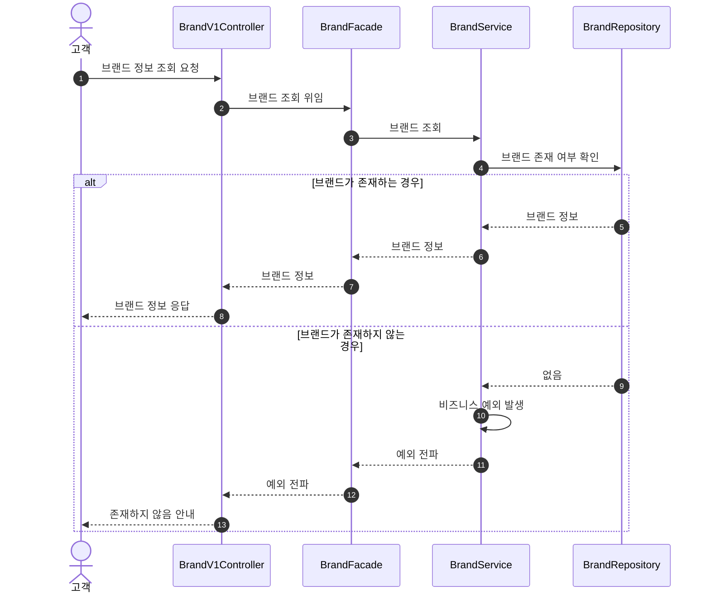
```mermaid
sequenceDiagram
    autonumber
    actor 고객
    participant Controller as BrandV1Controller
    participant Facade as BrandFacade
    participant Service as BrandService
    participant Repository as BrandRepository

    고객->>Controller: 브랜드 정보 조회 요청
    Controller->>Facade: 브랜드 조회 위임
    Facade->>Service: 브랜드 조회
    Service->>Repository: 브랜드 존재 여부 확인

    alt 브랜드가 존재하는 경우
        Repository-->>Service: 브랜드 정보
        Service-->>Facade: 브랜드 정보
        Facade-->>Controller: 브랜드 정보
        Controller-->>고객: 브랜드 정보 응답
    else 브랜드가 존재하지 않는 경우
        Repository-->>Service: 없음
        Service->>Service: 비즈니스 예외 발생
        Service-->>Facade: 예외 전파
        Facade-->>Controller: 예외 전파
        Controller-->>고객: 존재하지 않음 안내
    end
```

#### 봐야 할 포인트

1. **예외 발생 위치**: Repository는 "없음"만 반환하고, 비즈니스 예외로 변환하는 책임은 Service에 있다.
2. **Facade의 역할**: 단일 도메인 조회이므로 Facade는 Service 호출을 위임만 한다.

---

### US-B02: 브랜드 목록 조회 (관리자)

#### 검증 목적

목록 조회는 결과가 비어있어도 정상 응답이므로 예외 분기가 없다. 단건 조회와의 차이를 확인한다.

#### 시퀀스 다이어그램

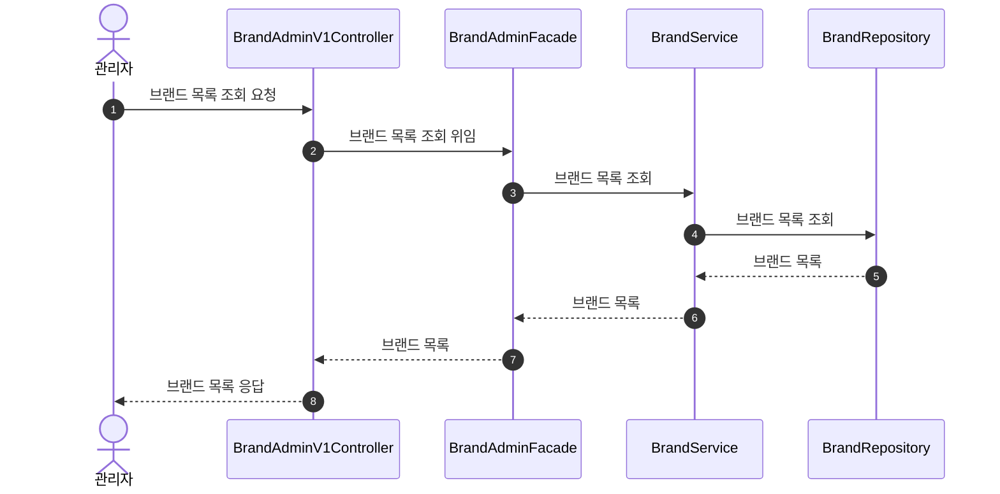
```mermaid
sequenceDiagram
    autonumber
    actor 관리자
    participant Controller as BrandAdminV1Controller
    participant Facade as BrandAdminFacade
    participant Service as BrandService
    participant Repository as BrandRepository

    관리자->>Controller: 브랜드 목록 조회 요청
    Controller->>Facade: 브랜드 목록 조회 위임
    Facade->>Service: 브랜드 목록 조회
    Service->>Repository: 브랜드 목록 조회
    Repository-->>Service: 브랜드 목록
    Service-->>Facade: 브랜드 목록
    Facade-->>Controller: 브랜드 목록
    Controller-->>관리자: 브랜드 목록 응답
```

#### 봐야 할 포인트

1. **예외 분기 없음**: 결과가 비어있어도 빈 목록으로 정상 응답한다.
2. **BR-B02**: 관리자용 브랜드 정보는 고객용과 다를 수 있다. 차이는 Controller의 DTO 변환에서 결정된다.

---

### US-B03: 브랜드 상세 조회 (관리자)

#### 검증 목적

관리자 단건 조회가 고객 조회(US-B01)와 동일한 계층 흐름을 따르되, 응답 범위만 다른지 확인한다.

#### 시퀀스 다이어그램

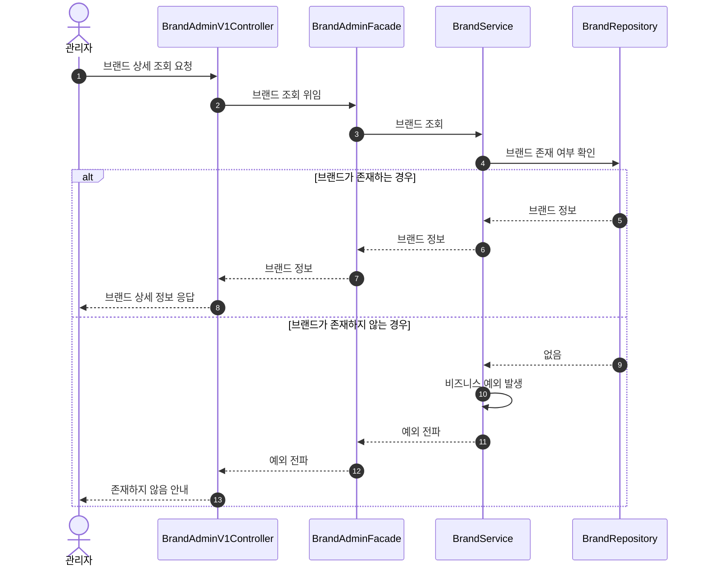
```mermaid
sequenceDiagram
    autonumber
    actor 관리자
    participant Controller as BrandAdminV1Controller
    participant Facade as BrandAdminFacade
    participant Service as BrandService
    participant Repository as BrandRepository

    관리자->>Controller: 브랜드 상세 조회 요청
    Controller->>Facade: 브랜드 조회 위임
    Facade->>Service: 브랜드 조회
    Service->>Repository: 브랜드 존재 여부 확인

    alt 브랜드가 존재하는 경우
        Repository-->>Service: 브랜드 정보
        Service-->>Facade: 브랜드 정보
        Facade-->>Controller: 브랜드 정보
        Controller-->>관리자: 브랜드 상세 정보 응답
    else 브랜드가 존재하지 않는 경우
        Repository-->>Service: 없음
        Service->>Service: 비즈니스 예외 발생
        Service-->>Facade: 예외 전파
        Facade-->>Controller: 예외 전파
        Controller-->>관리자: 존재하지 않음 안내
    end
```

#### 봐야 할 포인트

1. **US-B01과 동일한 흐름**: 차이는 액터(관리자)와 응답 DTO의 범위뿐이다. BR-B02에 따라 관리자용 정보가 더 상세할 수 있다.

---

### US-B04: 브랜드 등록 (관리자)

#### 검증 목적

브랜드 등록 시 브랜드명 중복 여부를 확인한 후 저장하는 흐름을 검증한다. 다른 도메인에 대한 의존은 없지만, 도메인 내부 유일성 제약이 존재한다.

#### 시퀀스 다이어그램

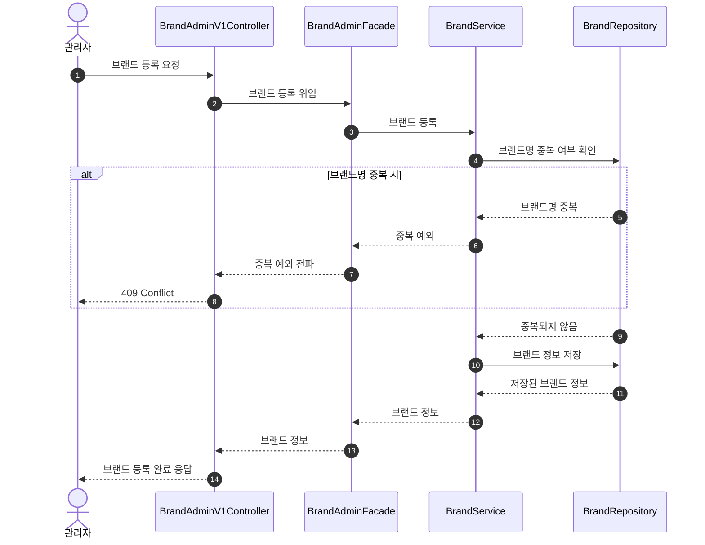
```mermaid
sequenceDiagram
    autonumber
    actor 관리자
    participant Controller as BrandAdminV1Controller
    participant Facade as BrandAdminFacade
    participant Service as BrandService
    participant Repository as BrandRepository

    관리자->>Controller: 브랜드 등록 요청
    Controller->>Facade: 브랜드 등록 위임
    Facade->>Service: 브랜드 등록
    Service->>Repository: 브랜드명 중복 여부 확인

    alt 브랜드명 중복 시
        Repository-->>Service: 브랜드명 중복
        Service-->>Facade: 중복 예외
        Facade-->>Controller: 중복 예외 전파
        Controller-->>관리자: 409 Conflict
    end

    Repository-->>Service: 중복되지 않음
    Service->>Repository: 브랜드 정보 저장
    Repository-->>Service: 저장된 브랜드 정보
    Service-->>Facade: 브랜드 정보
    Facade-->>Controller: 브랜드 정보
    Controller-->>관리자: 브랜드 등록 완료 응답
```

#### 봐야 할 포인트

1. **브랜드명 중복 검증**: Service가 저장 전에 동일 브랜드명의 존재 여부를 확인한다. 중복 시 CONFLICT(409)로 응답한다.
2. **early-return 패턴**: 중복 검증 실패 시 즉시 예외를 반환하고, 정상 흐름은 `alt` 블록 이후에 계속된다.

---

### US-B05: 브랜드 정보 수정 (관리자)

#### 검증 목적

브랜드 수정 시 "존재 여부 확인 → 브랜드명 중복 확인 → 수정" 순서를 확인한다. US-B04와 마찬가지로 브랜드명 유일성 제약이 적용된다.

#### 시퀀스 다이어그램

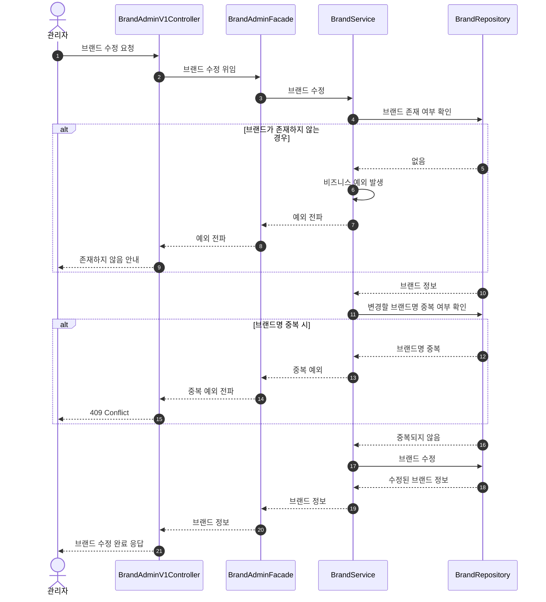
```mermaid
sequenceDiagram
    autonumber
    actor 관리자
    participant Controller as BrandAdminV1Controller
    participant Facade as BrandAdminFacade
    participant Service as BrandService
    participant Repository as BrandRepository

    관리자->>Controller: 브랜드 수정 요청
    Controller->>Facade: 브랜드 수정 위임
    Facade->>Service: 브랜드 수정
    Service->>Repository: 브랜드 존재 여부 확인

    alt 브랜드가 존재하지 않는 경우
        Repository-->>Service: 없음
        Service->>Service: 비즈니스 예외 발생
        Service-->>Facade: 예외 전파
        Facade-->>Controller: 예외 전파
        Controller-->>관리자: 존재하지 않음 안내
    end

    Repository-->>Service: 브랜드 정보
    Service->>Repository: 변경할 브랜드명 중복 여부 확인

    alt 브랜드명 중복 시
        Repository-->>Service: 브랜드명 중복
        Service-->>Facade: 중복 예외
        Facade-->>Controller: 중복 예외 전파
        Controller-->>관리자: 409 Conflict
    end

    Repository-->>Service: 중복되지 않음
    Service->>Repository: 브랜드 수정
    Repository-->>Service: 수정된 브랜드 정보
    Service-->>Facade: 브랜드 정보
    Facade-->>Controller: 브랜드 정보
    Controller-->>관리자: 브랜드 수정 완료 응답
```

#### 봐야 할 포인트

1. **이중 검증**: 존재 확인 → 브랜드명 중복 확인 → 수정의 3단계. US-B04(등록)의 단일 검증보다 한 단계가 추가된다.
2. **자기 자신 제외**: 수정 시 브랜드명 중복 확인은 자기 자신을 제외한 다른 브랜드와 비교해야 한다. 이 구분은 Repository 쿼리에서 처리된다.

---

### US-B06: 브랜드 삭제 (관리자)

#### 검증 목적

BR-B01(연쇄 삭제)의 책임이 어느 계층에 있는지 확인한다. 브랜드 삭제 → 상품 삭제 → 좋아요 삭제의 3단계 연쇄가 발생하며, Facade가 BrandService, ProductService, LikeService를 조율한다.

#### 시퀀스 다이어그램

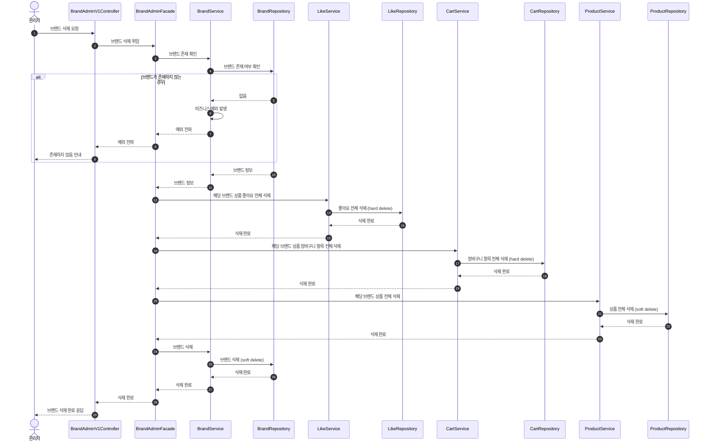
```mermaid
sequenceDiagram
    autonumber
    actor 관리자
    participant Controller as BrandAdminV1Controller
    participant Facade as BrandAdminFacade
    participant BrandService
    participant BrandRepository
    participant LikeService
    participant LikeRepository
    participant CartService
    participant CartRepository
    participant ProductService
    participant ProductRepository

    관리자->>Controller: 브랜드 삭제 요청
    Controller->>Facade: 브랜드 삭제 위임
    Facade->>BrandService: 브랜드 존재 확인
    BrandService->>BrandRepository: 브랜드 존재 여부 확인

    alt 브랜드가 존재하지 않는 경우
        BrandRepository-->>BrandService: 없음
        BrandService->>BrandService: 비즈니스 예외 발생
        BrandService-->>Facade: 예외 전파
        Facade-->>Controller: 예외 전파
        Controller-->>관리자: 존재하지 않음 안내
    end

    BrandRepository-->>BrandService: 브랜드 정보
    BrandService-->>Facade: 브랜드 정보
    Facade->>LikeService: 해당 브랜드 상품 좋아요 전체 삭제
    LikeService->>LikeRepository: 좋아요 전체 삭제 (hard delete)
    LikeRepository-->>LikeService: 삭제 완료
    LikeService-->>Facade: 삭제 완료
    Facade->>CartService: 해당 브랜드 상품 장바구니 항목 전체 삭제
    CartService->>CartRepository: 장바구니 항목 전체 삭제 (hard delete)
    CartRepository-->>CartService: 삭제 완료
    CartService-->>Facade: 삭제 완료
    Facade->>ProductService: 해당 브랜드 상품 전체 삭제
    ProductService->>ProductRepository: 상품 전체 삭제 (soft delete)
    ProductRepository-->>ProductService: 삭제 완료
    ProductService-->>Facade: 삭제 완료
    Facade->>BrandService: 브랜드 삭제
    BrandService->>BrandRepository: 브랜드 삭제 (soft delete)
    BrandRepository-->>BrandService: 삭제 완료
    BrandService-->>Facade: 삭제 완료
    Facade-->>Controller: 삭제 완료
    Controller-->>관리자: 브랜드 삭제 완료 응답
```

#### 봐야 할 포인트

1. **Facade의 4-서비스 조율**: BrandService, LikeService, CartService, ProductService는 서로를 모른다. 도메인 간 삭제 순서를 Facade가 결정한다.
2. **삭제 순서와 정책**: 좋아요(hard delete) → 장바구니 항목(hard delete) → 상품(soft delete) → 브랜드(soft delete). 종속 데이터를 먼저 정리해야 상위 엔티티 삭제 후 고아 데이터가 남지 않는다.

#### 잠재 리스크

- **트랜잭션 범위**: 좋아요 삭제, 장바구니 항목 삭제, 상품 삭제, 브랜드 삭제가 하나의 트랜잭션으로 묶여야 한다. 4개 서비스를 포함하므로 트랜잭션이 넓다.
- **Soft Delete 연쇄 정책**: 브랜드 복원 시 상품도 함께 복원해야 하는지, 복원된 상품의 좋아요와 장바구니 항목은 이미 hard delete되어 복원 불가능한 점을 어떻게 다룰지 정책 결정이 필요하다.

---

## 2.2 상품 (Product)

### US-P01: 상품 목록 조회 (고객)

#### 검증 목적

상품 목록 조회에는 브랜드 필터링, 정렬(BR-P03, BR-P04), 페이징이 포함된다. 필터/정렬 조건의 처리 책임이 어느 계층에 있는지 확인한다.

#### 시퀀스 다이어그램

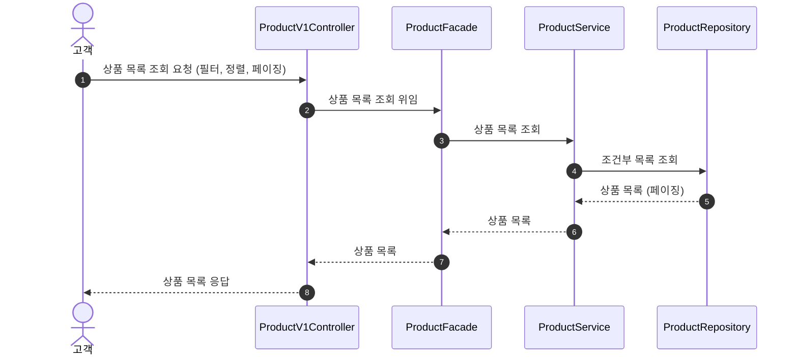
```mermaid
sequenceDiagram
    autonumber
    actor 고객
    participant Controller as ProductV1Controller
    participant Facade as ProductFacade
    participant Service as ProductService
    participant Repository as ProductRepository

    고객->>Controller: 상품 목록 조회 요청 (필터, 정렬, 페이징)
    Controller->>Facade: 상품 목록 조회 위임
    Facade->>Service: 상품 목록 조회
    Service->>Repository: 조건부 목록 조회
    Repository-->>Service: 상품 목록 (페이징)
    Service-->>Facade: 상품 목록
    Facade-->>Controller: 상품 목록
    Controller-->>고객: 상품 목록 응답
```

#### 봐야 할 포인트

1. **필터/정렬 책임**: 브랜드 필터링과 정렬 조건은 Repository 계층의 쿼리로 처리된다. Service는 조건을 전달만 한다.
2. **BR-P05**: 고객에게는 재고 여부(있음/없음)만 노출하고, 구체적 재고 수량은 숨긴다. DTO 변환에서 결정된다.

---

### US-P02: 상품 상세 조회 (고객)

#### 검증 목적

단건 조회의 정상/예외 분기를 확인한다. 브랜드 조회(US-B01)와 동일한 패턴을 따른다.

#### 시퀀스 다이어그램

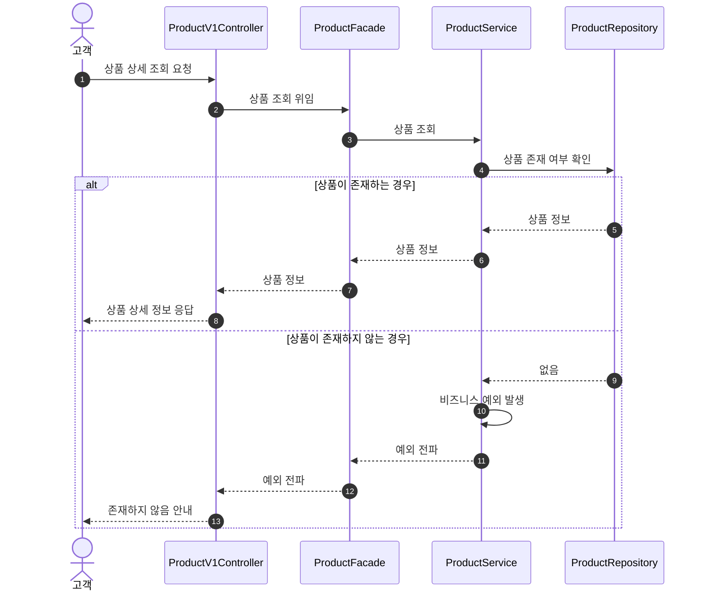
```mermaid
sequenceDiagram
    autonumber
    actor 고객
    participant Controller as ProductV1Controller
    participant Facade as ProductFacade
    participant Service as ProductService
    participant Repository as ProductRepository

    고객->>Controller: 상품 상세 조회 요청
    Controller->>Facade: 상품 조회 위임
    Facade->>Service: 상품 조회
    Service->>Repository: 상품 존재 여부 확인

    alt 상품이 존재하는 경우
        Repository-->>Service: 상품 정보
        Service-->>Facade: 상품 정보
        Facade-->>Controller: 상품 정보
        Controller-->>고객: 상품 상세 정보 응답
    else 상품이 존재하지 않는 경우
        Repository-->>Service: 없음
        Service->>Service: 비즈니스 예외 발생
        Service-->>Facade: 예외 전파
        Facade-->>Controller: 예외 전파
        Controller-->>고객: 존재하지 않음 안내
    end
```

#### 봐야 할 포인트

1. **US-B01과 동일한 패턴**: 단건 조회의 존재/부재 분기는 모든 도메인에서 동일하게 적용된다.

---

### US-P03: 상품 목록 조회 (관리자)

#### 검증 목적

관리자 목록 조회가 고객 목록 조회(US-P01)와 동일한 흐름을 따르되, 응답 정보의 범위만 다른지 확인한다.

#### 시퀀스 다이어그램

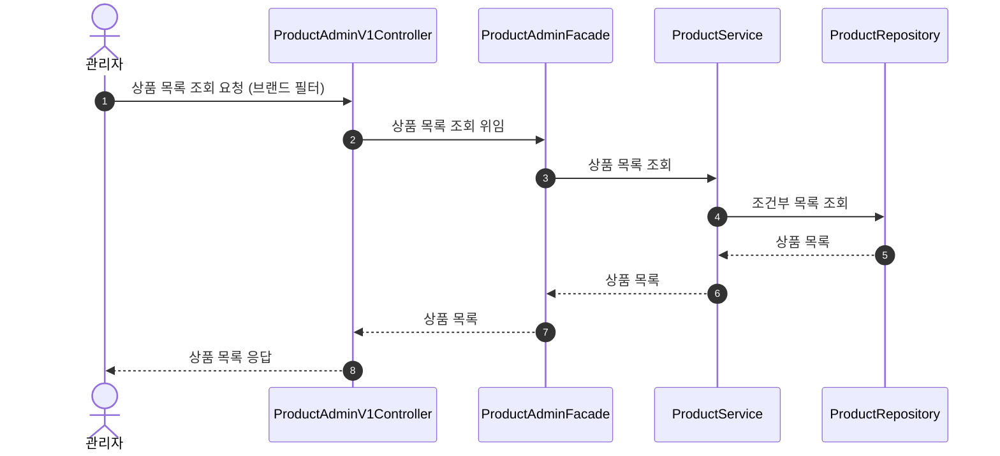
```mermaid
sequenceDiagram
    autonumber
    actor 관리자
    participant Controller as ProductAdminV1Controller
    participant Facade as ProductAdminFacade
    participant Service as ProductService
    participant Repository as ProductRepository

    관리자->>Controller: 상품 목록 조회 요청 (브랜드 필터)
    Controller->>Facade: 상품 목록 조회 위임
    Facade->>Service: 상품 목록 조회
    Service->>Repository: 조건부 목록 조회
    Repository-->>Service: 상품 목록
    Service-->>Facade: 상품 목록
    Facade-->>Controller: 상품 목록
    Controller-->>관리자: 상품 목록 응답
```

#### 봐야 할 포인트

1. **BR-P05**: 관리자에게는 재고 수량까지 노출된다. 고객용/관리자용 차이는 Controller의 DTO 변환에서 결정된다.

---

### US-P04: 상품 상세 조회 (관리자)

#### 검증 목적

관리자 단건 조회가 US-P02와 동일한 흐름을 따르는지 확인한다.

#### 시퀀스 다이어그램

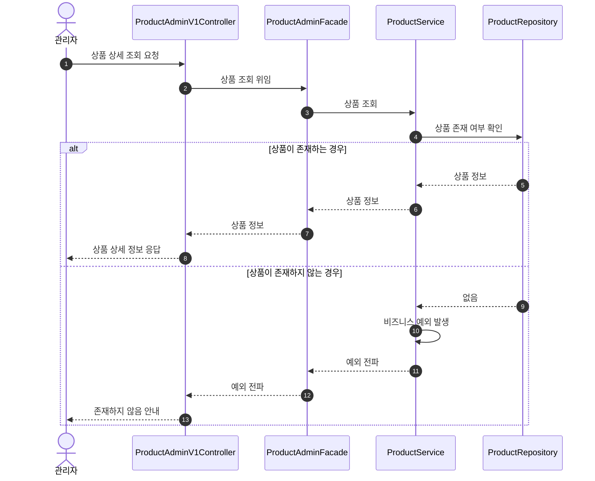
```mermaid
sequenceDiagram
    autonumber
    actor 관리자
    participant Controller as ProductAdminV1Controller
    participant Facade as ProductAdminFacade
    participant Service as ProductService
    participant Repository as ProductRepository

    관리자->>Controller: 상품 상세 조회 요청
    Controller->>Facade: 상품 조회 위임
    Facade->>Service: 상품 조회
    Service->>Repository: 상품 존재 여부 확인

    alt 상품이 존재하는 경우
        Repository-->>Service: 상품 정보
        Service-->>Facade: 상품 정보
        Facade-->>Controller: 상품 정보
        Controller-->>관리자: 상품 상세 정보 응답
    else 상품이 존재하지 않는 경우
        Repository-->>Service: 없음
        Service->>Service: 비즈니스 예외 발생
        Service-->>Facade: 예외 전파
        Facade-->>Controller: 예외 전파
        Controller-->>관리자: 존재하지 않음 안내
    end
```

#### 봐야 할 포인트

1. **US-P02와 동일한 흐름**: 액터와 응답 DTO 범위만 다르다.

---

### US-P05: 상품 등록 (관리자)

#### 검증 목적

상품 등록 시 두 가지를 검증한다: BR-P01(브랜드 존재 여부)은 Facade가 도메인 간 조율로 처리하고, 같은 브랜드 내 상품명 중복은 ProductService가 내부에서 처리한다.

#### 시퀀스 다이어그램

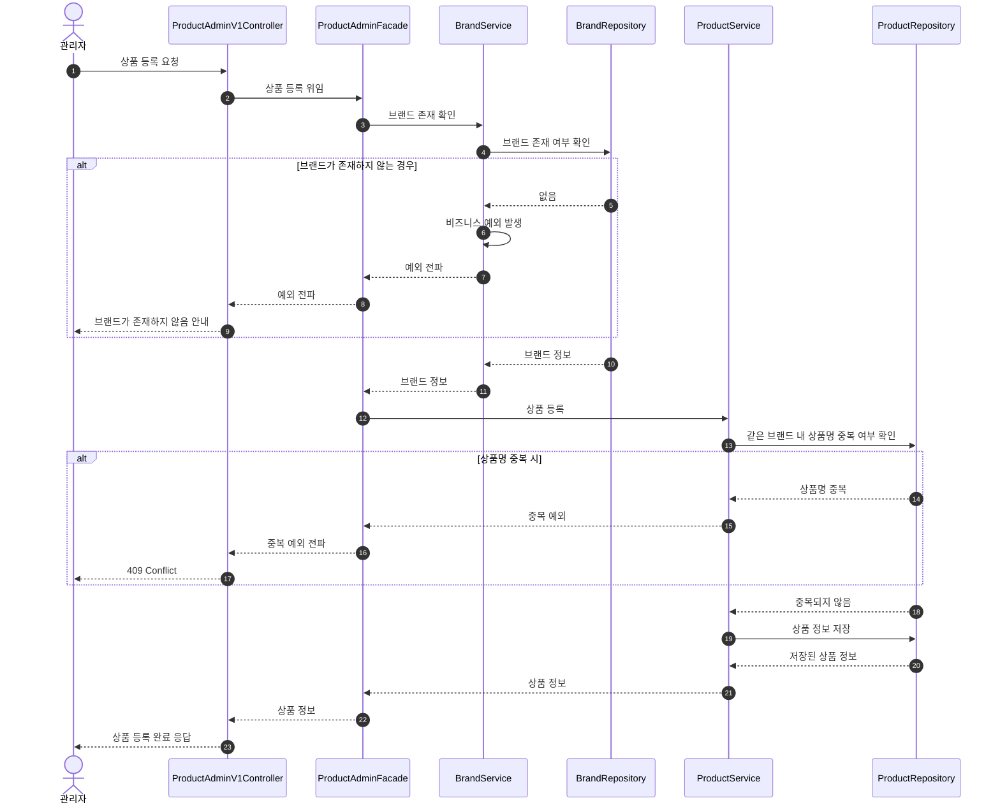
```mermaid
sequenceDiagram
    autonumber
    actor 관리자
    participant Controller as ProductAdminV1Controller
    participant Facade as ProductAdminFacade
    participant BrandService
    participant BrandRepository
    participant ProductService
    participant ProductRepository

    관리자->>Controller: 상품 등록 요청
    Controller->>Facade: 상품 등록 위임
    Facade->>BrandService: 브랜드 존재 확인
    BrandService->>BrandRepository: 브랜드 존재 여부 확인

    alt 브랜드가 존재하지 않는 경우
        BrandRepository-->>BrandService: 없음
        BrandService->>BrandService: 비즈니스 예외 발생
        BrandService-->>Facade: 예외 전파
        Facade-->>Controller: 예외 전파
        Controller-->>관리자: 브랜드가 존재하지 않음 안내
    end

    BrandRepository-->>BrandService: 브랜드 정보
    BrandService-->>Facade: 브랜드 정보
    Facade->>ProductService: 상품 등록
    ProductService->>ProductRepository: 같은 브랜드 내 상품명 중복 여부 확인

    alt 상품명 중복 시
        ProductRepository-->>ProductService: 상품명 중복
        ProductService-->>Facade: 중복 예외
        Facade-->>Controller: 중복 예외 전파
        Controller-->>관리자: 409 Conflict
    end

    ProductRepository-->>ProductService: 중복되지 않음
    ProductService->>ProductRepository: 상품 정보 저장
    ProductRepository-->>ProductService: 저장된 상품 정보
    ProductService-->>Facade: 상품 정보
    Facade-->>Controller: 상품 정보
    Controller-->>관리자: 상품 등록 완료 응답
```

#### 봐야 할 포인트

1. **검증 책임의 분리**: 브랜드 존재 확인(도메인 간)은 Facade가, 상품명 중복 확인(도메인 내)은 ProductService가 처리한다. US-B04의 브랜드명 중복 검증과 동일한 패턴.
2. **중복 범위**: 상품명 중복은 전체가 아닌 **같은 브랜드 내**에서만 확인한다. 다른 브랜드에 동일한 상품명이 존재하는 것은 허용된다.

---

### US-P06: 상품 정보 수정 (관리자)

#### 검증 목적

상품 수정 시 "존재 여부 확인 → 같은 브랜드 내 상품명 중복 확인 → 수정" 순서를 확인한다. BR-P02(소속 브랜드 변경 불가)는 도메인 모델 수준에서 보장된다.

#### 시퀀스 다이어그램

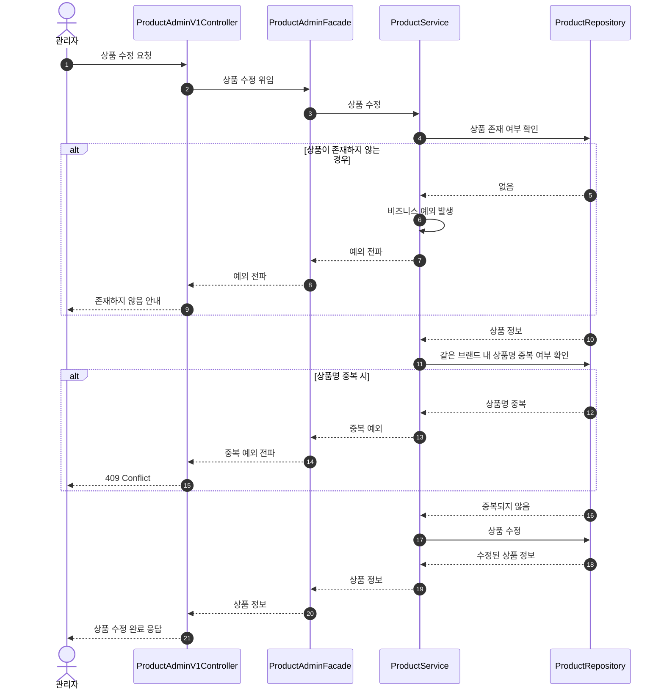
```mermaid
sequenceDiagram
    autonumber
    actor 관리자
    participant Controller as ProductAdminV1Controller
    participant Facade as ProductAdminFacade
    participant Service as ProductService
    participant Repository as ProductRepository

    관리자->>Controller: 상품 수정 요청
    Controller->>Facade: 상품 수정 위임
    Facade->>Service: 상품 수정
    Service->>Repository: 상품 존재 여부 확인

    alt 상품이 존재하지 않는 경우
        Repository-->>Service: 없음
        Service->>Service: 비즈니스 예외 발생
        Service-->>Facade: 예외 전파
        Facade-->>Controller: 예외 전파
        Controller-->>관리자: 존재하지 않음 안내
    end

    Repository-->>Service: 상품 정보
    Service->>Repository: 같은 브랜드 내 상품명 중복 여부 확인

    alt 상품명 중복 시
        Repository-->>Service: 상품명 중복
        Service-->>Facade: 중복 예외
        Facade-->>Controller: 중복 예외 전파
        Controller-->>관리자: 409 Conflict
    end

    Repository-->>Service: 중복되지 않음
    Service->>Repository: 상품 수정
    Repository-->>Service: 수정된 상품 정보
    Service-->>Facade: 상품 정보
    Facade-->>Controller: 상품 정보
    Controller-->>관리자: 상품 수정 완료 응답
```

#### 봐야 할 포인트

1. **이중 검증**: US-B05(브랜드 수정)와 동일한 패턴. 존재 확인 → 상품명 중복 확인 → 수정.
2. **자기 자신 제외**: 상품명 중복 확인 시 자기 자신은 제외해야 한다. Repository 쿼리에서 처리.
3. **BR-P02 브랜드 불변성**: 소속 브랜드 변경은 도메인 모델이 브랜드 변경 setter를 제공하지 않는 방식으로 보장한다. 시퀀스 다이어그램의 관심사(컴포넌트 간 흐름)가 아닌 모델 설계의 관심사이다.

---

### US-P07: 상품 삭제 (관리자)

#### 검증 목적

상품 삭제 시 해당 상품의 좋아요도 함께 정리해야 한다. 상품은 soft delete, 좋아요는 hard delete로 삭제 정책이 다르므로 Facade가 ProductService와 LikeService를 조율하는 cross-domain 처리이다.

#### 시퀀스 다이어그램

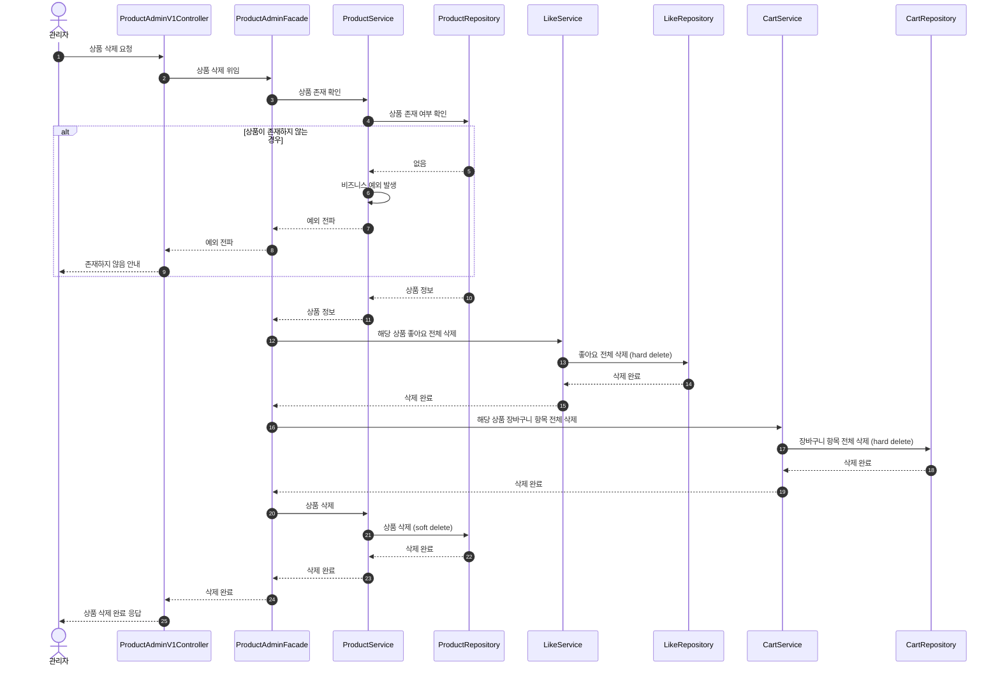
```mermaid
sequenceDiagram
    autonumber
    actor 관리자
    participant Controller as ProductAdminV1Controller
    participant Facade as ProductAdminFacade
    participant ProductService
    participant ProductRepository
    participant LikeService
    participant LikeRepository
    participant CartService
    participant CartRepository

    관리자->>Controller: 상품 삭제 요청
    Controller->>Facade: 상품 삭제 위임
    Facade->>ProductService: 상품 존재 확인
    ProductService->>ProductRepository: 상품 존재 여부 확인

    alt 상품이 존재하지 않는 경우
        ProductRepository-->>ProductService: 없음
        ProductService->>ProductService: 비즈니스 예외 발생
        ProductService-->>Facade: 예외 전파
        Facade-->>Controller: 예외 전파
        Controller-->>관리자: 존재하지 않음 안내
    end

    ProductRepository-->>ProductService: 상품 정보
    ProductService-->>Facade: 상품 정보
    Facade->>LikeService: 해당 상품 좋아요 전체 삭제
    LikeService->>LikeRepository: 좋아요 전체 삭제 (hard delete)
    LikeRepository-->>LikeService: 삭제 완료
    LikeService-->>Facade: 삭제 완료
    Facade->>CartService: 해당 상품 장바구니 항목 전체 삭제
    CartService->>CartRepository: 장바구니 항목 전체 삭제 (hard delete)
    CartRepository-->>CartService: 삭제 완료
    CartService-->>Facade: 삭제 완료
    Facade->>ProductService: 상품 삭제
    ProductService->>ProductRepository: 상품 삭제 (soft delete)
    ProductRepository-->>ProductService: 삭제 완료
    ProductService-->>Facade: 삭제 완료
    Facade-->>Controller: 삭제 완료
    Controller-->>관리자: 상품 삭제 완료 응답
```

#### 봐야 할 포인트

1. **삭제 정책의 혼합**: 좋아요(hard delete) → 장바구니 항목(hard delete) → 상품(soft delete) 순서로 처리한다. 종속 데이터를 먼저 정리해야 soft delete된 상품에 고아 데이터가 남는 불일치를 방지한다.
2. **US-B06과 동일한 패턴**: 브랜드 삭제 시 상품을 정리하듯, 상품 삭제 시 좋아요와 장바구니 항목을 정리한다. Facade가 도메인 간 삭제 순서를 결정한다.

#### 상품 도메인 잠재 리스크

- **검증 위치의 기준**: 도메인 간 검증(브랜드 존재 확인)은 Facade가, 도메인 내부 규칙(상품명 중복, 브랜드 불변성)은 Service/Model이 처리한다.

---

## 2.3 좋아요 (Like)

> **삭제 정책**: 좋아요는 **hard delete**를 사용한다. 브랜드/상품과 달리 이력으로서 보존할 가치가 없으므로 물리적으로 삭제한다.

### US-L01: 상품 좋아요 등록

#### 검증 목적

좋아요 등록 시 세 가지를 처리한다: 상품 존재 확인(도메인 간), 중복 좋아요 확인(BR-L01), 그리고 상품의 좋아요 수 업데이트. Facade가 LikeService와 ProductService를 조율하는 흐름을 확인한다.

#### 시퀀스 다이어그램

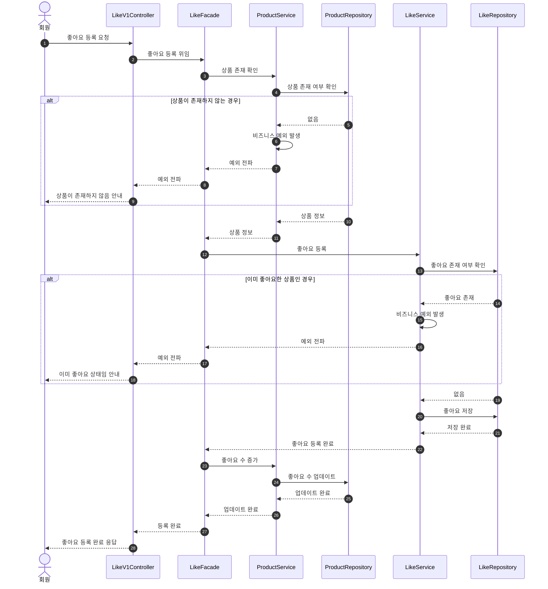
```mermaid
sequenceDiagram
    autonumber
    actor 회원
    participant Controller as LikeV1Controller
    participant Facade as LikeFacade
    participant ProductService
    participant ProductRepository
    participant LikeService
    participant LikeRepository

    회원->>Controller: 좋아요 등록 요청
    Controller->>Facade: 좋아요 등록 위임
    Facade->>ProductService: 상품 존재 확인
    ProductService->>ProductRepository: 상품 존재 여부 확인

    alt 상품이 존재하지 않는 경우
        ProductRepository-->>ProductService: 없음
        ProductService->>ProductService: 비즈니스 예외 발생
        ProductService-->>Facade: 예외 전파
        Facade-->>Controller: 예외 전파
        Controller-->>회원: 상품이 존재하지 않음 안내
    end

    ProductRepository-->>ProductService: 상품 정보
    ProductService-->>Facade: 상품 정보
    Facade->>LikeService: 좋아요 등록
    LikeService->>LikeRepository: 좋아요 존재 여부 확인

    alt 이미 좋아요한 상품인 경우
        LikeRepository-->>LikeService: 좋아요 존재
        LikeService->>LikeService: 비즈니스 예외 발생
        LikeService-->>Facade: 예외 전파
        Facade-->>Controller: 예외 전파
        Controller-->>회원: 이미 좋아요 상태임 안내
    end

    LikeRepository-->>LikeService: 없음
    LikeService->>LikeRepository: 좋아요 저장
    LikeRepository-->>LikeService: 저장 완료
    LikeService-->>Facade: 좋아요 등록 완료
    Facade->>ProductService: 좋아요 수 증가
    ProductService->>ProductRepository: 좋아요 수 업데이트
    ProductRepository-->>ProductService: 업데이트 완료
    ProductService-->>Facade: 업데이트 완료
    Facade-->>Controller: 등록 완료
    Controller-->>회원: 좋아요 등록 완료 응답
```

#### 봐야 할 포인트

1. **Facade의 3단계 조율**: 상품 존재 확인(ProductService) → 좋아요 등록(LikeService) → 좋아요 수 증가(ProductService). 세 단계를 하나의 트랜잭션으로 묶어야 한다.
2. **좋아요 수 업데이트 시점**: 좋아요 등록이 성공한 후에 수를 증가시킨다. 등록 실패(중복) 시에는 수를 변경하지 않는다.

---

### US-L02: 상품 좋아요 취소

#### 검증 목적

좋아요 취소 시 좋아요 레코드를 hard delete하고, 상품의 좋아요 수를 감소시키는 흐름을 확인한다. 좋아요 취소는 도메인 간 조율이 필요한 cross-domain 처리이다.

#### 시퀀스 다이어그램

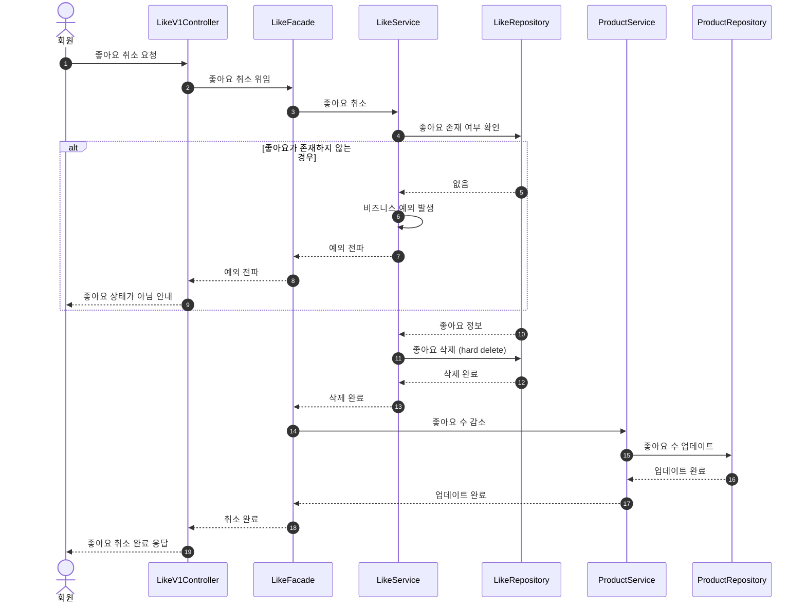
```mermaid
sequenceDiagram
    autonumber
    actor 회원
    participant Controller as LikeV1Controller
    participant Facade as LikeFacade
    participant LikeService
    participant LikeRepository
    participant ProductService
    participant ProductRepository

    회원->>Controller: 좋아요 취소 요청
    Controller->>Facade: 좋아요 취소 위임
    Facade->>LikeService: 좋아요 취소
    LikeService->>LikeRepository: 좋아요 존재 여부 확인

    alt 좋아요가 존재하지 않는 경우
        LikeRepository-->>LikeService: 없음
        LikeService->>LikeService: 비즈니스 예외 발생
        LikeService-->>Facade: 예외 전파
        Facade-->>Controller: 예외 전파
        Controller-->>회원: 좋아요 상태가 아님 안내
    end

    LikeRepository-->>LikeService: 좋아요 정보
    LikeService->>LikeRepository: 좋아요 삭제 (hard delete)
    LikeRepository-->>LikeService: 삭제 완료
    LikeService-->>Facade: 삭제 완료
    Facade->>ProductService: 좋아요 수 감소
    ProductService->>ProductRepository: 좋아요 수 업데이트
    ProductRepository-->>ProductService: 업데이트 완료
    ProductService-->>Facade: 업데이트 완료
    Facade-->>Controller: 취소 완료
    Controller-->>회원: 좋아요 취소 완료 응답
```

#### 봐야 할 포인트

1. **hard delete**: 좋아요 레코드는 물리적으로 삭제된다. soft delete와 달리 복원이 불가능하지만, 좋아요는 이력 보존이 불필요하다.
2. **좋아요 수 감소**: 삭제 성공 후 상품의 좋아요 수를 감소시킨다. US-L01의 역연산.

---

### US-L03: 좋아요한 상품 목록 조회

#### 검증 목적

회원이 자신의 좋아요 목록만 조회할 수 있는지(BR-L03) 확인한다. 목록 조회이므로 예외 분기가 없다.

#### 시퀀스 다이어그램

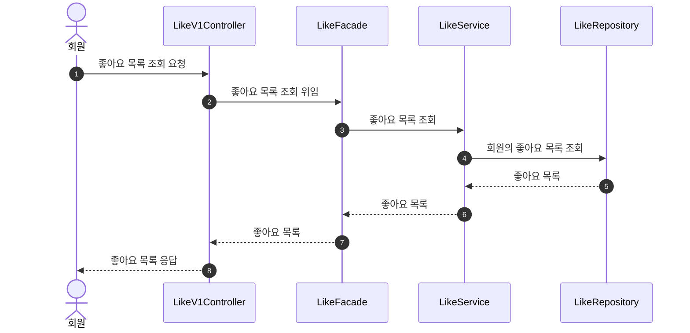
```mermaid
sequenceDiagram
    autonumber
    actor 회원
    participant Controller as LikeV1Controller
    participant Facade as LikeFacade
    participant Service as LikeService
    participant Repository as LikeRepository

    회원->>Controller: 좋아요 목록 조회 요청
    Controller->>Facade: 좋아요 목록 조회 위임
    Facade->>Service: 좋아요 목록 조회
    Service->>Repository: 회원의 좋아요 목록 조회
    Repository-->>Service: 좋아요 목록
    Service-->>Facade: 좋아요 목록
    Facade-->>Controller: 좋아요 목록
    Controller-->>회원: 좋아요 목록 응답
```

#### 봐야 할 포인트

1. **BR-L03 소유권 제한**: 인증된 회원 ID를 기준으로 자신의 좋아요만 조회한다. Controller에서 인증 정보를 추출하여 전달한다.

#### 좋아요 도메인 잠재 리스크

- **좋아요 수와 실제 레코드의 정합성**: 좋아요 수(Product 컬럼)와 실제 Like 레코드 수가 어긋날 수 있다. 트랜잭션 내에서 원자적으로 처리하되, 장기적으로는 배치로 보정하는 방어 전략도 고려할 수 있다.
- **좋아요 수 동시성**: 동일 상품에 여러 회원이 동시에 좋아요하면 좋아요 수 컬럼에 경합이 발생한다. 낙관적 잠금(@Version) 또는 원자적 증감(UPDATE SET count = count + 1)으로 방어가 필요하다.
- **동시 좋아요 요청**: 같은 회원이 동일 상품에 동시에 좋아요 요청을 보내면 중복이 발생할 수 있다. 유니크 제약 조건(DB 레벨)으로 방어하는 것이 안전하다.

---

## 2.4 장바구니 (Cart)

### US-C01: 장바구니에 상품 담기

#### 검증 목적

BR-C02에 따라 이미 장바구니에 있는 상품을 다시 담으면 수량이 누적된다. "신규 추가"와 "수량 누적"의 분기 처리 책임이 어느 계층에 있는지 확인한다.

#### 시퀀스 다이어그램

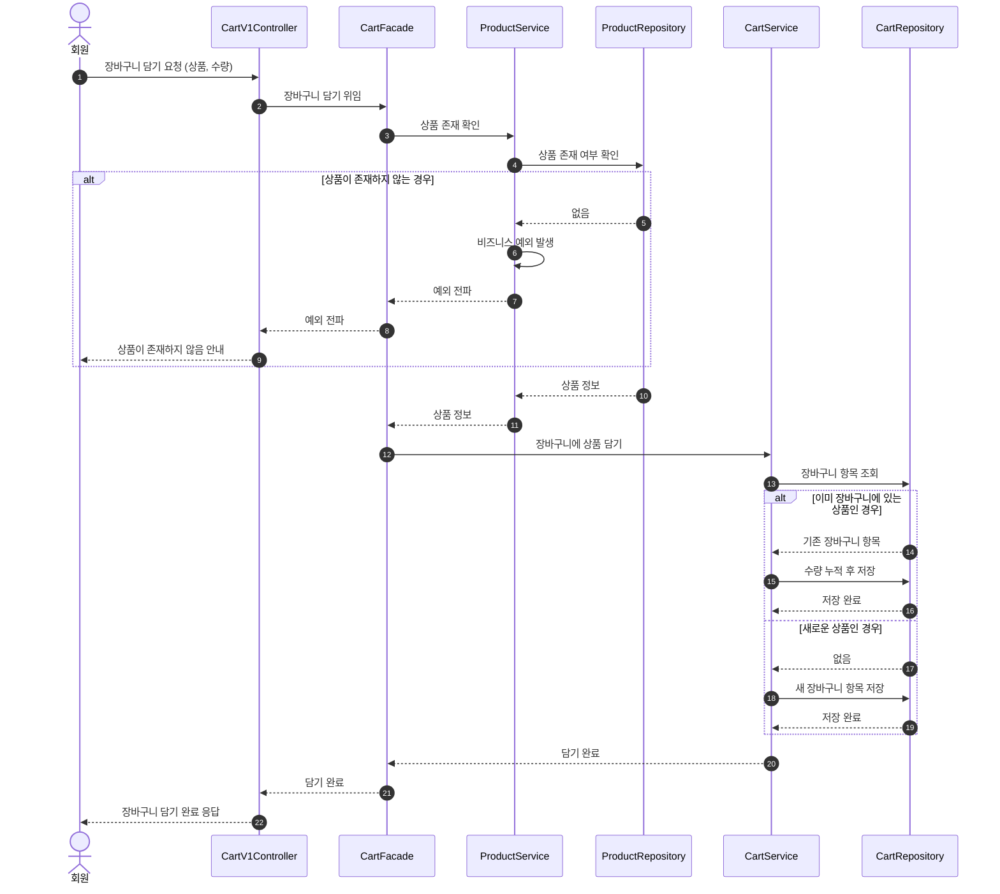
```mermaid
sequenceDiagram
    autonumber
    actor 회원
    participant Controller as CartV1Controller
    participant Facade as CartFacade
    participant ProductService
    participant ProductRepository
    participant CartService
    participant CartRepository

    회원->>Controller: 장바구니 담기 요청 (상품, 수량)
    Controller->>Facade: 장바구니 담기 위임
    Facade->>ProductService: 상품 존재 확인
    ProductService->>ProductRepository: 상품 존재 여부 확인

    alt 상품이 존재하지 않는 경우
        ProductRepository-->>ProductService: 없음
        ProductService->>ProductService: 비즈니스 예외 발생
        ProductService-->>Facade: 예외 전파
        Facade-->>Controller: 예외 전파
        Controller-->>회원: 상품이 존재하지 않음 안내
    end

    ProductRepository-->>ProductService: 상품 정보
    ProductService-->>Facade: 상품 정보
    Facade->>CartService: 장바구니에 상품 담기
    CartService->>CartRepository: 장바구니 항목 조회

    alt 이미 장바구니에 있는 상품인 경우
        CartRepository-->>CartService: 기존 장바구니 항목
        CartService->>CartRepository: 수량 누적 후 저장
        CartRepository-->>CartService: 저장 완료
    else 새로운 상품인 경우
        CartRepository-->>CartService: 없음
        CartService->>CartRepository: 새 장바구니 항목 저장
        CartRepository-->>CartService: 저장 완료
    end

    CartService-->>Facade: 담기 완료
    Facade-->>Controller: 담기 완료
    Controller-->>회원: 장바구니 담기 완료 응답
```

#### 봐야 할 포인트

1. **수량 누적 판단의 책임**: CartService가 CartRepository를 통해 기존 항목 존재 여부를 확인하고, 존재하면 수량을 누적, 없으면 새 항목을 생성한다. Facade는 "담기"를 요청할 뿐, 신규/누적 분기를 알 필요가 없다.
2. **상품 검증은 Facade 책임**: 도메인 간 검증(상품 존재)은 US-P05, US-L01과 동일하게 Facade가 조율한다.

---

### US-C02: 장바구니 조회

#### 검증 목적

회원이 자신의 장바구니만 조회하는 흐름(BR-C04)을 확인한다.

#### 시퀀스 다이어그램

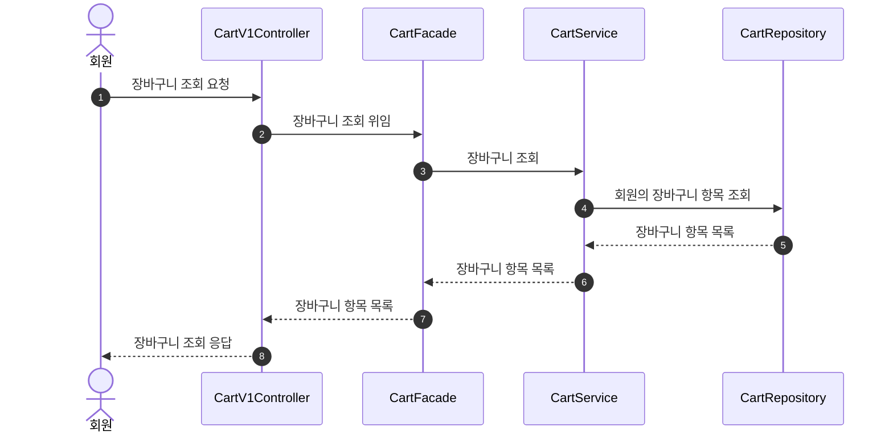
```mermaid
sequenceDiagram
    autonumber
    actor 회원
    participant Controller as CartV1Controller
    participant Facade as CartFacade
    participant Service as CartService
    participant Repository as CartRepository

    회원->>Controller: 장바구니 조회 요청
    Controller->>Facade: 장바구니 조회 위임
    Facade->>Service: 장바구니 조회
    Service->>Repository: 회원의 장바구니 항목 조회
    Repository-->>Service: 장바구니 항목 목록
    Service-->>Facade: 장바구니 항목 목록
    Facade-->>Controller: 장바구니 항목 목록
    Controller-->>회원: 장바구니 조회 응답
```

#### 봐야 할 포인트

1. **BR-C04 소유권 제한**: 인증된 회원 ID 기준으로 자신의 장바구니만 조회한다.
2. **빈 장바구니도 정상 응답**: 장바구니에 항목이 없어도 빈 목록으로 정상 응답한다.

---

### US-C03: 장바구니 상품 수량 변경

#### 검증 목적

수량 변경 시 BR-C03(수량 1 이상)과 장바구니 항목 존재 여부를 어느 계층에서 검증하는지 확인한다.

#### 시퀀스 다이어그램

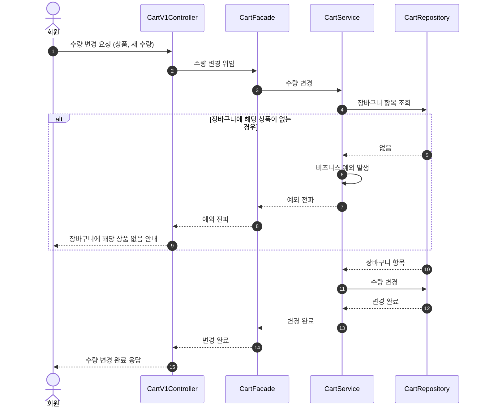
```mermaid
sequenceDiagram
    autonumber
    actor 회원
    participant Controller as CartV1Controller
    participant Facade as CartFacade
    participant Service as CartService
    participant Repository as CartRepository

    회원->>Controller: 수량 변경 요청 (상품, 새 수량)
    Controller->>Facade: 수량 변경 위임
    Facade->>Service: 수량 변경
    Service->>Repository: 장바구니 항목 조회

    alt 장바구니에 해당 상품이 없는 경우
        Repository-->>Service: 없음
        Service->>Service: 비즈니스 예외 발생
        Service-->>Facade: 예외 전파
        Facade-->>Controller: 예외 전파
        Controller-->>회원: 장바구니에 해당 상품 없음 안내
    end

    Repository-->>Service: 장바구니 항목
    Service->>Repository: 수량 변경
    Repository-->>Service: 변경 완료
    Service-->>Facade: 변경 완료
    Facade-->>Controller: 변경 완료
    Controller-->>회원: 수량 변경 완료 응답
```

#### 봐야 할 포인트

1. **BR-C03 수량 검증 위치**: 수량이 1 이상인지 검증은 Service 또는 도메인 모델에서 처리한다. Controller의 요청 검증(@Valid)에서 먼저 걸러낼 수도 있다.

---

### US-C04: 장바구니 상품 제거

#### 검증 목적

장바구니 항목 제거의 흐름을 확인한다. 존재하지 않는 항목 제거 시도에 대한 예외 처리를 검증한다.

#### 시퀀스 다이어그램

```mermaid
sequenceDiagram
    autonumber
    actor 회원
    participant Controller as CartV1Controller
    participant Facade as CartFacade
    participant Service as CartService
    participant Repository as CartRepository

    회원->>Controller: 장바구니 상품 제거 요청
    Controller->>Facade: 상품 제거 위임
    Facade->>Service: 장바구니 항목 제거
    Service->>Repository: 장바구니 항목 조회

    alt 장바구니에 해당 상품이 없는 경우
        Repository-->>Service: 없음
        Service->>Service: 비즈니스 예외 발생
        Service-->>Facade: 예외 전파
        Facade-->>Controller: 예외 전파
        Controller-->>회원: 장바구니에 해당 상품 없음 안내
    end

    Repository-->>Service: 장바구니 항목
    Service->>Repository: 항목 삭제
    Repository-->>Service: 삭제 완료
    Service-->>Facade: 제거 완료
    Facade-->>Controller: 제거 완료
    Controller-->>회원: 상품 제거 완료 응답
```

#### 봐야 할 포인트

1. **US-C03과 동일한 전제**: 장바구니 항목의 존재 여부를 먼저 확인한다. early-return으로 예외를 빼고 정상 흐름은 블록 바깥에 둔다.

#### 장바구니 도메인 잠재 리스크

- **수량 누적의 상한**: BR-C02에서 수량 누적에 상한이 없다. 재고보다 많은 수량을 장바구니에 담는 것을 허용할지, 담기 시점에 재고를 검증할지 결정이 필요하다.

---

## 2.5 주문 (Order)

### US-O01: 주문 생성

#### 검증 목적

가장 복잡한 흐름이다. BR-O01~O05가 모두 적용된다. 여러 상품의 재고 확인 → 주문 생성(스냅샷 포함) → 재고 차감이 하나의 트랜잭션으로 처리되어야 하며, Facade가 ProductService와 OrderService를 조율하는 흐름을 확인한다.

#### 시퀀스 다이어그램

```mermaid
sequenceDiagram
    autonumber
    actor 회원
    participant Controller as OrderV1Controller
    participant Facade as OrderFacade
    participant ProductService
    participant ProductRepository
    participant OrderService
    participant OrderRepository

    회원->>Controller: 주문 요청 (상품 목록, 수량)
    Controller->>Facade: 주문 생성 위임
    Facade->>ProductService: 상품 존재 및 재고 확인
    ProductService->>ProductRepository: 상품 존재 여부 확인

    alt 상품이 존재하지 않는 경우
        ProductRepository-->>ProductService: 없음
        ProductService->>ProductService: 비즈니스 예외 발생
        ProductService-->>Facade: 예외 전파
        Facade-->>Controller: 예외 전파
        Controller-->>회원: 존재하지 않는 상품 안내
    end

    ProductRepository-->>ProductService: 상품 정보
    ProductService->>ProductService: 재고 충분 여부 확인

    alt 재고가 부족한 경우
        ProductService->>ProductService: 비즈니스 예외 발생
        ProductService-->>Facade: 예외 전파
        Facade-->>Controller: 예외 전파
        Controller-->>회원: 재고 부족 안내
    end

    ProductService-->>Facade: 상품 정보 (스냅샷용)
    Facade->>OrderService: 주문 생성 (스냅샷 포함)
    OrderService->>OrderRepository: 주문 정보 저장
    OrderRepository-->>OrderService: 저장된 주문 정보
    OrderService-->>Facade: 주문 정보
    Facade->>ProductService: 재고 차감
    ProductService->>ProductRepository: 재고 수량 업데이트
    ProductRepository-->>ProductService: 업데이트 완료
    ProductService-->>Facade: 차감 완료
    Facade-->>Controller: 주문 정보
    Controller-->>회원: 주문 완료 응답
```

#### 봐야 할 포인트

1. **Facade의 핵심 조율**: 이 시나리오에서 Facade의 존재 의미가 가장 명확하다. 재고 확인 → 주문 생성 → 재고 차감을 하나의 유스케이스로 조율한다.
2. **스냅샷 생성 시점**: ProductService에서 받은 상품 정보를 OrderService에 전달하여 스냅샷으로 보존한다. 스냅샷은 주문 시점의 상품명, 가격, 브랜드 등을 포함한다(BR-O05).
3. **재고 차감 순서**: 주문 생성 후 재고를 차감한다. 만약 재고 차감이 먼저라면, 주문 생성 실패 시 차감을 복원해야 하는 보상 로직이 필요해진다.

---

### US-O02: 주문 목록 조회 (회원)

#### 검증 목적

BR-O06(자신의 주문만 조회)과 BR-O08(기간 필터)이 적용되는 흐름을 확인한다.

#### 시퀀스 다이어그램

```mermaid
sequenceDiagram
    autonumber
    actor 회원
    participant Controller as OrderV1Controller
    participant Facade as OrderFacade
    participant Service as OrderService
    participant Repository as OrderRepository

    회원->>Controller: 주문 목록 조회 요청 (시작일, 종료일)
    Controller->>Facade: 주문 목록 조회 위임
    Facade->>Service: 주문 목록 조회
    Service->>Repository: 회원의 주문 목록 조회 (기간 필터)
    Repository-->>Service: 주문 목록
    Service-->>Facade: 주문 목록
    Facade-->>Controller: 주문 목록
    Controller-->>회원: 주문 목록 응답
```

#### 봐야 할 포인트

1. **BR-O06 + BR-O08**: 인증된 회원 ID와 기간 조건을 조합하여 조회한다. 기간이 지정되지 않은 경우의 기본값 정책도 결정이 필요하다.

---

### US-O03: 주문 상세 조회 (회원)

#### 검증 목적

회원이 자신의 주문만 조회할 수 있는지(BR-O06), 타인의 주문 접근 시 거부되는지 확인한다.

#### 시퀀스 다이어그램

```mermaid
sequenceDiagram
    autonumber
    actor 회원
    participant Controller as OrderV1Controller
    participant Facade as OrderFacade
    participant Service as OrderService
    participant Repository as OrderRepository

    회원->>Controller: 주문 상세 조회 요청
    Controller->>Facade: 주문 조회 위임
    Facade->>Service: 주문 조회
    Service->>Repository: 주문 조회

    alt 주문이 존재하지 않는 경우
        Repository-->>Service: 없음
        Service->>Service: 비즈니스 예외 발생
        Service-->>Facade: 예외 전파
        Facade-->>Controller: 예외 전파
        Controller-->>회원: 존재하지 않음 안내
    end

    Repository-->>Service: 주문 정보
    Service->>Service: 본인 주문 여부 확인

    alt 다른 회원의 주문인 경우
        Service->>Service: 접근 거부 예외 발생
        Service-->>Facade: 예외 전파
        Facade-->>Controller: 예외 전파
        Controller-->>회원: 접근 거부 안내
    end

    Service-->>Facade: 주문 정보 (스냅샷 포함)
    Facade-->>Controller: 주문 정보
    Controller-->>회원: 주문 상세 정보 응답
```

#### 봐야 할 포인트

1. **이중 검증**: 존재 확인 → 소유권 확인의 2단계 early-return. "존재하지 않음"(NOT_FOUND)과 "접근 거부"(FORBIDDEN)는 다른 예외 타입이다.
2. **스냅샷 정보 포함**: 주문 상세에는 주문 당시의 상품/브랜드 정보(스냅샷)가 포함된다.

---

### US-O04: 주문 목록 조회 (관리자)

#### 검증 목적

관리자가 전체 주문을 페이지 단위로 조회하는 흐름(BR-O07)을 확인한다.

#### 시퀀스 다이어그램

```mermaid
sequenceDiagram
    autonumber
    actor 관리자
    participant Controller as OrderAdminV1Controller
    participant Facade as OrderAdminFacade
    participant Service as OrderService
    participant Repository as OrderRepository

    관리자->>Controller: 전체 주문 목록 조회 요청 (페이징)
    Controller->>Facade: 주문 목록 조회 위임
    Facade->>Service: 전체 주문 목록 조회
    Service->>Repository: 전체 주문 목록 조회 (페이징)
    Repository-->>Service: 주문 목록
    Service-->>Facade: 주문 목록
    Facade-->>Controller: 주문 목록
    Controller-->>관리자: 주문 목록 응답
```

#### 봐야 할 포인트

1. **소유권 제한 없음**: 관리자는 BR-O07에 따라 전체 주문을 조회할 수 있다. 회원 조회(US-O02)와 달리 소유권 필터가 없다.

---

### US-O05: 주문 상세 조회 (관리자)

#### 검증 목적

관리자의 단건 주문 조회를 확인한다. 회원 조회(US-O03)와 달리 소유권 확인이 불필요하다.

#### 시퀀스 다이어그램

```mermaid
sequenceDiagram
    autonumber
    actor 관리자
    participant Controller as OrderAdminV1Controller
    participant Facade as OrderAdminFacade
    participant Service as OrderService
    participant Repository as OrderRepository

    관리자->>Controller: 주문 상세 조회 요청
    Controller->>Facade: 주문 조회 위임
    Facade->>Service: 주문 조회
    Service->>Repository: 주문 조회

    alt 주문이 존재하지 않는 경우
        Repository-->>Service: 없음
        Service->>Service: 비즈니스 예외 발생
        Service-->>Facade: 예외 전파
        Facade-->>Controller: 예외 전파
        Controller-->>관리자: 존재하지 않음 안내
    end

    Repository-->>Service: 주문 정보
    Service-->>Facade: 주문 정보 (스냅샷 포함)
    Facade-->>Controller: 주문 정보
    Controller-->>관리자: 주문 상세 정보 응답
```

#### 봐야 할 포인트

1. **US-O03과의 차이**: 소유권 검증이 없다. 관리자는 모든 주문에 접근 가능하다. US-O03의 이중 검증과 달리 존재 확인만 수행한다.

#### 주문 도메인 잠재 리스크

- **재고 차감의 원자성**: US-O01에서 재고 확인 → 주문 생성 → 재고 차감이 하나의 트랜잭션이어야 한다. 동시에 여러 주문이 같은 상품을 주문하면 재고가 음수가 될 수 있으므로, 비관적 잠금(SELECT FOR UPDATE) 또는 낙관적 잠금(@Version) 전략이 필요하다.
- **트랜잭션 범위의 비대화**: 주문 생성 트랜잭션이 ProductService(재고 확인/차감)와 OrderService(주문 생성)를 모두 포함하므로 범위가 넓다. 상품 수가 많으면 잠금 시간이 길어질 수 있다.
- **스냅샷 데이터의 정합성**: 스냅샷은 주문 시점의 데이터 사본이다. ProductService에서 상품 정보를 조회한 시점과 실제 저장 시점 사이에 상품 정보가 변경될 가능성은 트랜잭션으로 방어한다.
