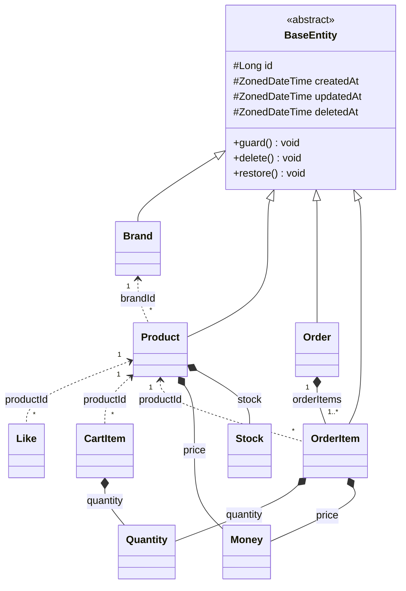
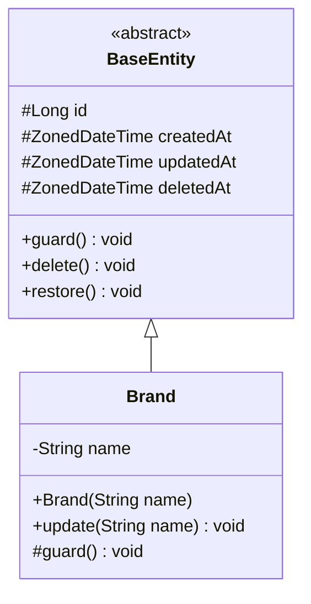
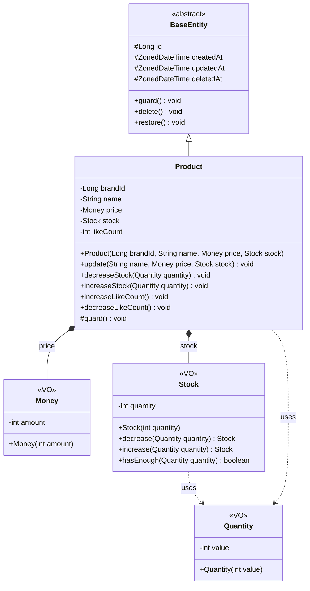
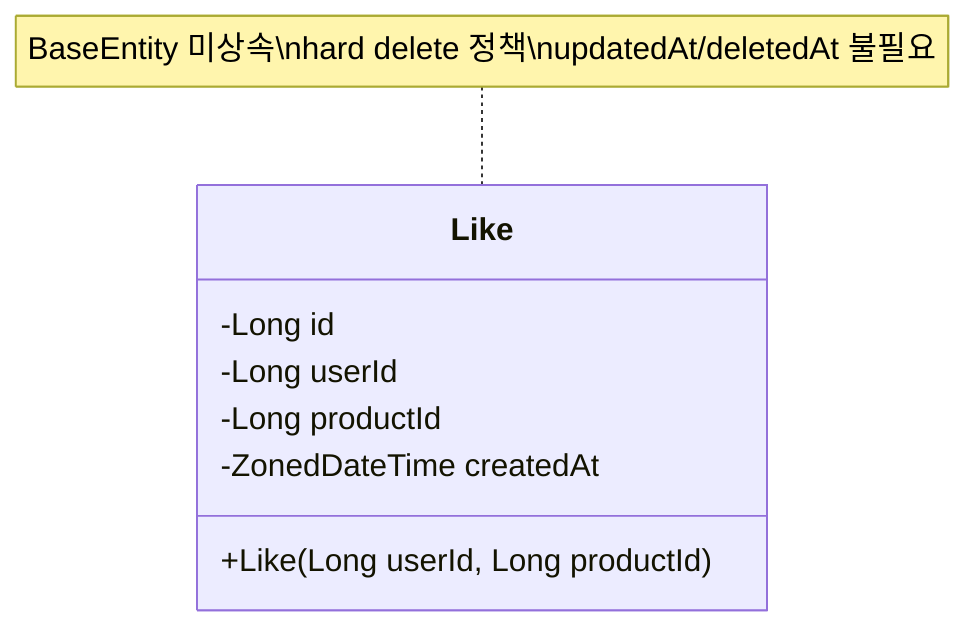
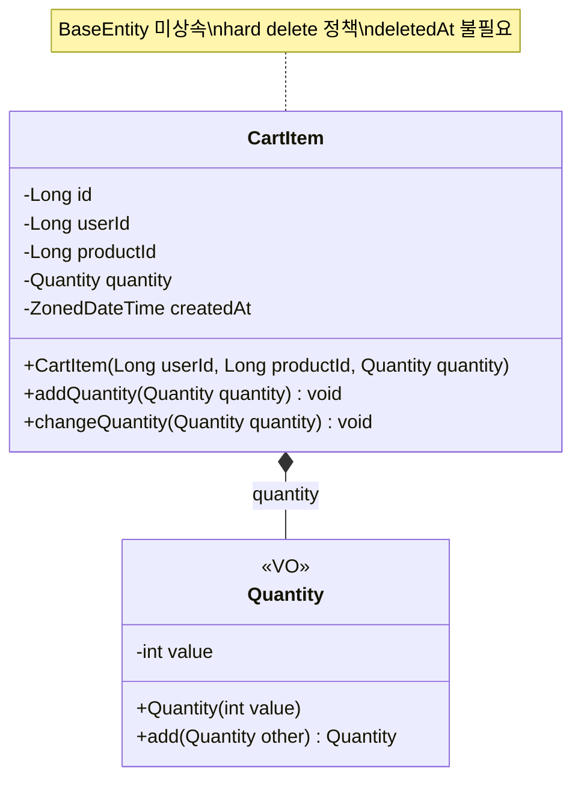
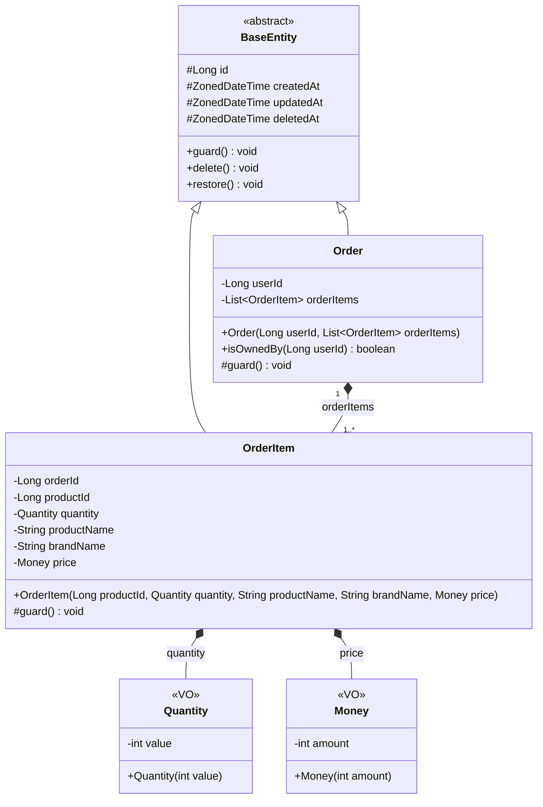

# 클래스 다이어그램

## 공통 사항

### BaseEntity

모든 soft delete 정책 엔티티가 상속하는 추상 클래스이다.

- `id` (Long): `@GeneratedValue(IDENTITY)` 자동 생성
- `createdAt`, `updatedAt`: `@PrePersist`/`@PreUpdate` 자동 관리
- `deletedAt`: soft delete 마커 (`delete()`, `restore()` 멱등 연산)
- `guard()`: 하위 클래스가 재정의하여 `@PrePersist`/`@PreUpdate` 시점에 불변 조건을 검증

### VO 설계 원칙

- **ID 없음**: 고유 식별자를 갖지 않는다. 속성 값으로만 동등성을 판단한다.
- **불변**: 생성 후 내부 상태가 변하지 않는다. 상태 변경이 필요하면 새 인스턴스를 반환한다.
- **분리 기준**: 2개 이상 도메인에서 재사용되거나, 자체 행위/검증 규칙이 있을 때 VO로 분리한다.

| VO | 사용처 | 분리 근거 |
|----|--------|----------|
| Money | Product.price, OrderItem.price | 2곳 재사용 + 음수 불가 검증 |
| Stock | Product.stock | 자체 행위 3개 (decrease, increase, hasEnough) → Product 책임 분산 |
| Quantity | CartItem.quantity, OrderItem.quantity | 2곳 재사용 + >= 1 검증 (BR-C03, BR-O02) |

### 연관 관계 원칙

- **모두 단방향**, ID 참조(Long)로 느슨하게 연결한다.
- 유일한 composition: **Order ◆── OrderItem** (Order가 Aggregate Root)
- 양방향 관계는 사용하지 않는다.

---

## 전체 도메인 관계도

### 검증 목적

엔티티 간 관계, BaseEntity 상속 여부, VO 소속을 한눈에 파악한다.

### 다이어그램

### 봐야 할 포인트

1. **Like, CartItem은 BaseEntity 미상속**: 둘 다 hard delete 정책이므로 `deletedAt`이 불필요하다. BaseEntity를 상속하면 사용하지 않는 `deletedAt` 컬럼과 `delete()`/`restore()` 메서드가 노출되어 상속 계약을 위반한다. 나머지 4개 엔티티(Brand, Product, Order, OrderItem)는 soft delete를 사용한다.
2. **ID 참조**: 점선 화살표(`<..`)는 Long 타입 ID로 참조하는 느슨한 연관이다. JPA `@ManyToOne`이 아닌 `Long brandId` 필드로 표현된다.
3. **유일한 composition**: Order → OrderItem만 실선 다이아몬드(`*--`)로 표현한다. OrderItem은 Order 없이 존재할 수 없다.

---

## 브랜드 (Brand)

### 검증 목적

가장 단순한 엔티티로, BaseEntity 상속과 `guard()` 재정의 패턴의 기본 형태를 확인한다.

### 다이어그램

### 봐야 할 포인트

1. **단일 필드**: `name` 하나만 관리한다. VO로 분리할 만큼 복잡한 검증 규칙이 없으므로 primitive `String`으로 유지한다.
2. **guard() 재정의**: `@PrePersist`/`@PreUpdate` 시점에 `name`이 null이거나 비어있지 않은지 검증한다.
3. **update() 메서드**: `name`만 수정 가능하다. 시퀀스 다이어그램(US-B05)에서 브랜드명 중복 확인은 Service 책임이며, 모델은 값의 유효성만 검증한다.

---

## 상품 (Product + Money VO + Stock VO)

### 검증 목적

4개의 관심사(name, price, stock, likeCount)를 가진 엔티티에서 VO를 통해 책임을 분산하는 패턴을 확인한다. BR-P02(브랜드 불변성)가 메서드 시그니처 수준에서 어떻게 보장되는지 확인한다.

### 다이어그램

### 봐야 할 포인트

1. **BR-P02 브랜드 불변성**: `update()` 메서드의 파라미터에 `brandId`가 없다. `brandId`를 변경할 수 있는 메서드가 존재하지 않으므로, 메서드 시그니처 수준에서 불변성이 보장된다.
2. **Money VO**: `amount`는 0 이상이어야 한다. 생성자에서 음수 검증을 수행한다. `Product.price`와 `OrderItem.price`에서 재사용된다.
3. **Stock VO**: 재고 관련 행위 3개(`decrease`, `increase`, `hasEnough`)를 캡슐화한다. 불변이므로 `decrease`/`increase`는 새 `Stock` 인스턴스를 반환한다. Product에서 재고 관련 로직을 분리하여 책임을 분산한다.
4. **Quantity VO**: `value >= 1` 검증을 생성자에서 수행한다 (BR-C03, BR-O02). `CartItem`과 `OrderItem`에서 재사용된다.
5. **likeCount는 primitive 유지**: 단순 증감만 수행하므로 VO로 분리할 근거가 없다. 증감 메서드(`increaseLikeCount`, `decreaseLikeCount`)를 Product가 직접 제공한다.
6. **Product.decreaseStock / increaseStock**: Stock VO에 위임하되, Product의 행위 메서드로 외부에 노출한다. Product가 "재고를 줄인다"는 도메인 의미를 유지하면서, 실제 로직은 Stock VO가 처리한다.

---

## 좋아요 (Like)

### 검증 목적

BaseEntity를 상속하지 않는 유일한 엔티티이다. hard delete 정책에 따라 자체적으로 `id`와 `createdAt`만 보유하는 구조를 확인한다.

### 다이어그램

### 봐야 할 포인트

1. **BaseEntity 미상속 이유**: Like는 (1) hard delete 정책이므로 `deletedAt`이 불필요하고, (2) 생성 후 수정이 없으므로 `updatedAt`이 불필요하다. BaseEntity의 4개 필드 중 `id`와 `createdAt`만 필요하므로 자체 필드로 선언한다.
2. **행위 메서드 없음**: Like는 생성과 삭제만 존재한다. 상태 변경이 없으므로 행위 메서드가 불필요하다.
3. **유니크 제약**: `(userId, productId)` 조합이 유일해야 한다 (BR-L01). 이는 DB 유니크 제약과 Service 레벨 중복 검증으로 이중 방어한다.
4. **ID 참조**: `userId`와 `productId`는 Long 타입으로 느슨하게 참조한다. User, Product 엔티티에 대한 직접 참조(`@ManyToOne`)를 사용하지 않는다.

---

## 장바구니 (CartItem + Quantity VO)

### 검증 목적

CartItem이 Quantity VO를 통해 수량 검증(BR-C03)을 위임하는 구조와, 수량 누적(BR-C02)이 도메인 모델의 행위 메서드로 표현되는지 확인한다. Like와 마찬가지로 hard delete 정책이므로 BaseEntity를 상속하지 않는다.

### 다이어그램

### 봐야 할 포인트

1. **BaseEntity 미상속 이유**: CartItem은 hard delete 정책이다. 회원이 장바구니에서 상품을 제거하면 물리 삭제하며, 관리자가 상품/브랜드를 삭제할 때도 해당 장바구니 항목을 물리 삭제한다. 이력 보존이 불필요하므로 `deletedAt`이 필요 없고, BaseEntity의 `delete()`/`restore()` 메서드가 노출되면 안 된다.
2. **addQuantity()**: BR-C02(수량 누적)를 구현한다. 이미 장바구니에 있는 상품을 다시 담으면, CartService가 기존 CartItem의 `addQuantity()`를 호출하여 수량을 누적한다. 내부적으로 Quantity VO의 `add()`에 위임한다.
3. **changeQuantity()**: US-C03(수량 변경)을 구현한다. 새 Quantity를 받아 교체한다. Quantity 생성자에서 `value >= 1` 검증이 수행되므로, 0 이하 수량은 VO 레벨에서 거부된다.
4. **Quantity.add()**: 불변 VO이므로 두 Quantity의 합산 결과를 새 인스턴스로 반환한다. `value >= 1` 검증은 생성자에서 수행되므로 `add()` 결과도 자동으로 유효하다.
5. **Cart 엔티티 없음**: BR-C01("회원은 하나의 장바구니를 가진다")이지만, 장바구니 자체를 엔티티로 두지 않고 `CartItem.userId`로 회원의 장바구니를 식별한다. CartItem의 집합이 곧 해당 회원의 장바구니이다.

---

## 주문 (Order + OrderItem)

### 검증 목적

가장 복잡한 도메인이다. Order가 Aggregate Root로서 OrderItem을 포함한다. OrderItem 자체가 주문 시점의 상품 정보를 보존하는 스냅샷 역할을 한다. BR-O01(최소 1개 항목), BR-O06(소유권 검증)이 도메인 모델에서 어떻게 보장되는지 확인한다.

### 다이어그램

### 봐야 할 포인트

1. **BR-O01 최소 항목 검증**: Order 생성자에서 `orderItems`가 비어있으면 예외를 발생시킨다. 빈 주문이 생성되는 것을 도메인 모델 수준에서 원천 차단한다.
2. **BR-O06 소유권 검증**: `isOwnedBy(userId)` 메서드로 주문의 소유자 여부를 판단한다. US-O03 시퀀스에서 Service가 이 메서드를 호출하여 타인의 주문 접근을 거부한다.
3. **OrderItem이 곧 스냅샷이다**: OrderItem이 `productName`, `brandName`, `price`를 직접 보유하여 주문 시점의 상품 정보를 보존한다 (BR-O05). OrderItem의 존재 이유 자체가 "주문 시점의 정보 보존"이므로, 별도 스냅샷 VO를 두지 않고 필드를 직접 갖는다. 원본 Product나 Brand가 이후 수정/삭제되어도 주문 기록에는 영향이 없다.
4. **Aggregate 경계**: Order가 Aggregate Root이고, OrderItem은 Order를 통해서만 접근한다. `Order.orderItems`는 `@OneToMany(cascade = ALL, orphanRemoval = true)`로 생명 주기를 함께 관리한다.
5. **OrderItem.orderId**: OrderItem이 BaseEntity를 상속하여 자체 id를 가진다. `orderId`는 DB 외래 키로 Order와 연결되지만, 도메인 모델에서는 Order가 `List<OrderItem>`으로 직접 참조한다.
6. **Money 재사용**: `OrderItem.price`는 `Product.price`와 동일한 Money VO를 사용한다. VO 분리의 이점이 여기서 드러난다.

---

## 잠재 리스크

### 책임 분산 점검표

| 엔티티 | 관심사 | 분산 방식 | 점검 |
|--------|--------|----------|------|
| Product | name | String (단순) | 검증만 필요, VO 불필요 |
| Product | price | Money VO | 음수 검증 위임 |
| Product | stock | Stock VO | 행위 3개(decrease, increase, hasEnough) 위임 |
| Product | likeCount | int (단순) | 증감만, VO 불필요 |
| CartItem | quantity | Quantity VO | >= 1 검증 + 수량 합산 위임 |
| OrderItem | quantity | Quantity VO | >= 1 검증 위임 |
| OrderItem | productName, brandName | String (단순) | 스냅샷 필드, OrderItem 자체가 스냅샷이므로 VO 불필요 |
| OrderItem | price | Money VO | Product.price와 동일 VO 재사용 |

### VO 설계 리스크

| 리스크 | 설명 | 대응 |
|--------|------|------|
| **Stock 불변성과 JPA 매핑** | Stock VO가 불변이므로 `decrease()`가 새 인스턴스를 반환한다. JPA `@Embedded`로 매핑할 때 setter가 필요한지 확인이 필요하다 | `@Embedded` + `@Column`으로 매핑하되, JPA 접근용 protected 기본 생성자만 허용한다. 상태 변경은 `Product.decreaseStock()`이 새 Stock을 할당하는 방식으로 처리한다 |
| **Quantity 재사용 범위** | CartItem과 OrderItem에서 동일한 Quantity VO를 사용한다. 두 도메인의 수량 규칙이 달라질 가능성이 있다 | 현재는 동일한 규칙(>= 1)이므로 공유한다. 규칙이 분기되는 시점에 각 도메인 전용 VO로 분리한다 |
| **Money 확장 가능성** | 현재 `int amount`로 원화만 지원한다. 통화 단위가 추가되면 VO 구조가 변경된다 | 현재 범위에서는 원화 단일 통화로 충분하다. 다중 통화 요구가 확정되면 `currency` 필드를 추가한다 |

### 도메인 간 정합성 리스크

| 리스크 | 관련 도메인 | 설명 |
|--------|------------|------|
| **좋아요 수 불일치** | Product ↔ Like | `Product.likeCount`와 실제 Like 레코드 수가 어긋날 수 있다. 트랜잭션 내 원자적 처리 + 배치 보정 전략이 필요하다 |
| ~~장바구니 상품 삭제~~ | ~~CartItem ↔ Product~~ | **해결됨**: 상품/브랜드 삭제 시 해당 장바구니 항목을 함께 물리 삭제한다. Like와 동일한 패턴 |
| **스냅샷 시점 정합성** | OrderItem ↔ Product | Facade에서 상품 정보를 조회한 시점과 Order를 저장하는 시점 사이에 상품 정보가 변경될 수 있다. 트랜잭션 격리 수준으로 방어한다 |
| **재고 동시성** | Product.stock ↔ Order | 동시 주문 시 재고가 음수가 될 수 있다. 비관적 잠금(SELECT FOR UPDATE) 또는 Stock VO의 `decrease()`에서 음수 검증으로 방어한다 |
