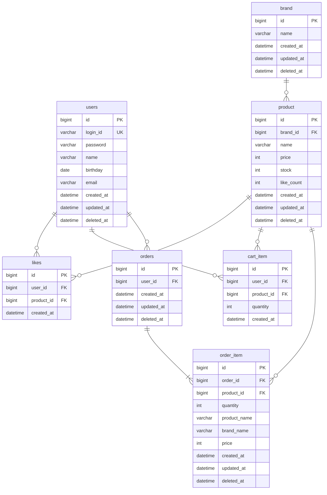

# ERD

---

## 전체 ERD

### 검증 목적

모든 테이블의 관계, FK 방향, 카디널리티를 한눈에 파악한다. 클래스 다이어그램의 ID 참조가 실제 FK로 어떻게 표현되는지 확인한다.

### 다이어그램



### 봐야 할 포인트

1. **users 테이블은 기존 구현**: 회원 도메인은 이미 구현되어 있으며 본 ERD에서는 FK 참조 대상으로만 포함한다.
2. **orders ↔ order_item**: 유일한 `||--|{` 관계(1:1이상). Order는 최소 1개의 OrderItem을 포함해야 한다 (BR-O01). 나머지는 모두 `||--o{`(1:0이상)이다.
3. **likes, cart_item에 deleted_at 없음**: hard delete 정책이므로 soft delete 컬럼이 불필요하다.
4. **order_item의 스냅샷 컬럼**: `product_name`, `brand_name`, `price`는 주문 시점의 상품 정보 사본이다. product, brand 테이블의 현재 값과 무관하게 주문 기록을 보존한다 (BR-O05).

---

## 테이블 상세

### brand

| 컬럼 | 타입 | 제약 | 설명 |
|------|------|------|------|
| id | BIGINT | PK, AUTO_INCREMENT | |
| name | VARCHAR(255) | NOT NULL | 브랜드명 |
| created_at | DATETIME | NOT NULL | |
| updated_at | DATETIME | NOT NULL | |
| deleted_at | DATETIME | | soft delete 마커 |

**유일성 제약**:
- `name`은 활성 상태(deleted_at IS NULL) 브랜드 내에서 유일해야 한다 (US-B04, US-B05)
- soft delete 테이블이므로 DB UNIQUE 제약만으로는 보장할 수 없다 → **애플리케이션 레벨에서 검증** (자세한 내용은 [데이터 정합성 전략 > 유일성 제약](#유일성-제약) 참고)

---

### product

| 컬럼 | 타입 | 제약 | 설명 |
|------|------|------|------|
| id | BIGINT | PK, AUTO_INCREMENT | |
| brand_id | BIGINT | NOT NULL, FK → brand(id) | 소속 브랜드. 생성 후 변경 불가 (BR-P02) |
| name | VARCHAR(255) | NOT NULL | 상품명 |
| price | INT | NOT NULL, >= 0 | 가격 (Money VO) |
| stock | INT | NOT NULL, >= 0 | 재고 수량 (Stock VO) |
| like_count | INT | NOT NULL, DEFAULT 0, >= 0 | 좋아요 수 |
| created_at | DATETIME | NOT NULL | |
| updated_at | DATETIME | NOT NULL | |
| deleted_at | DATETIME | | soft delete 마커 |

**유일성 제약**:
- `(brand_id, name)` 조합이 활성 상태 상품 내에서 유일해야 한다 (US-P05, US-P06)
- soft delete 테이블이므로 → **애플리케이션 레벨에서 검증**

**인덱스**:
- `idx_product_brand_id` → `brand_id`: 브랜드별 상품 필터링 (US-P01, US-P03)

---

### likes

| 컬럼 | 타입 | 제약 | 설명 |
|------|------|------|------|
| id | BIGINT | PK, AUTO_INCREMENT | |
| user_id | BIGINT | NOT NULL, FK → users(id) | 좋아요 누른 회원 |
| product_id | BIGINT | NOT NULL, FK → product(id) | 좋아요 대상 상품 |
| created_at | DATETIME | NOT NULL | |

**유일성 제약**:
- `uk_likes_user_product` → `UNIQUE(user_id, product_id)`: 한 회원은 동일 상품에 좋아요를 한 번만 등록 (BR-L01)
- hard delete 테이블이므로 **DB UNIQUE 제약으로 완전히 보장 가능**. 삭제 시 행이 물리적으로 제거되어 제약 슬롯이 해제된다

**인덱스**:
- `uk_likes_user_product`이 `(user_id, product_id)` 순서이므로, `user_id` 기준 조회(US-L03: 내 좋아요 목록)를 커버한다

---

### cart_item

| 컬럼 | 타입 | 제약 | 설명 |
|------|------|------|------|
| id | BIGINT | PK, AUTO_INCREMENT | |
| user_id | BIGINT | NOT NULL, FK → users(id) | 장바구니 소유 회원 |
| product_id | BIGINT | NOT NULL, FK → product(id) | 담긴 상품 |
| quantity | INT | NOT NULL, >= 1 | 수량 (Quantity VO) |
| created_at | DATETIME | NOT NULL | |

**유일성 제약**:
- `uk_cart_item_user_product` → `UNIQUE(user_id, product_id)`: 회원당 상품당 하나의 장바구니 항목만 존재. 같은 상품을 다시 담으면 기존 항목의 수량을 누적한다 (BR-C02)
- hard delete 테이블이므로 **DB UNIQUE 제약으로 완전히 보장 가능**

**인덱스**:
- `uk_cart_item_user_product`이 `(user_id, product_id)` 순서이므로, `user_id` 기준 조회(US-C02: 내 장바구니)를 커버한다

---

### orders

| 컬럼 | 타입 | 제약 | 설명 |
|------|------|------|------|
| id | BIGINT | PK, AUTO_INCREMENT | |
| user_id | BIGINT | NOT NULL, FK → users(id) | 주문한 회원 |
| created_at | DATETIME | NOT NULL | 주문 시각 |
| updated_at | DATETIME | NOT NULL | |
| deleted_at | DATETIME | | soft delete 마커 |

**인덱스**:
- `idx_orders_user_id_created_at` → `(user_id, created_at)`: 회원의 기간별 주문 목록 조회 (US-O02, BR-O08)

---

### order_item

| 컬럼 | 타입 | 제약 | 설명 |
|------|------|------|------|
| id | BIGINT | PK, AUTO_INCREMENT | |
| order_id | BIGINT | NOT NULL, FK → orders(id) | 소속 주문 |
| product_id | BIGINT | NOT NULL, FK → product(id) | 주문 대상 상품 (원본 추적용) |
| quantity | INT | NOT NULL, >= 1 | 주문 수량 (Quantity VO) |
| product_name | VARCHAR(255) | NOT NULL | 주문 시점 상품명 (스냅샷) |
| brand_name | VARCHAR(255) | NOT NULL | 주문 시점 브랜드명 (스냅샷) |
| price | INT | NOT NULL, >= 0 | 주문 시점 가격 (스냅샷, Money VO) |
| created_at | DATETIME | NOT NULL | |
| updated_at | DATETIME | NOT NULL | |
| deleted_at | DATETIME | | soft delete 마커 |

**인덱스**:
- `idx_order_item_order_id` → `order_id`: 주문 상세 조회 시 주문 항목 일괄 로딩 (US-O03, US-O05)

---

## 데이터 정합성 전략

### 참조 무결성

물리적 FK 제약 없이 애플리케이션 레벨에서 참조 무결성을 보장한다. 아래 표는 논리적 참조 관계와 그 정합성 보장 방식을 정리한 것이다.

| 논리적 참조 | 목적 | 정합성 보장 방식 |
|------------|------|----------------|
| product.brand_id → brand(id) | 상품은 반드시 존재하는 브랜드에 속한다 (BR-P01) | Facade가 브랜드 존재 확인 후 상품 등록 (US-P05) |
| likes.user_id → users(id) | 좋아요는 실존 회원만 가능 | AuthInterceptor가 인증된 회원만 허용 |
| likes.product_id → product(id) | 좋아요는 실존 상품만 가능 | Facade가 상품 존재 확인 후 좋아요 등록 (US-L01). 상품 삭제 시 likes를 먼저 hard delete (US-P07) |
| cart_item.user_id → users(id) | 장바구니는 실존 회원만 가능 | AuthInterceptor가 인증된 회원만 허용 |
| cart_item.product_id → product(id) | 장바구니는 실존 상품만 가능 | Facade가 상품 존재 확인 후 담기 (US-C01). 상품 삭제 시 cart_item을 먼저 hard delete (US-P07) |
| orders.user_id → users(id) | 주문은 실존 회원만 가능 | AuthInterceptor가 인증된 회원만 허용 |
| order_item.order_id → orders(id) | 주문 항목은 반드시 주문에 소속 | Order Aggregate가 OrderItem 생명주기를 관리 (cascade) |
| order_item.product_id → product(id) | 원본 상품 추적용 참조 | Facade가 상품 존재 및 재고 확인 후 주문 생성 (US-O01). 스냅샷 컬럼이 실제 데이터를 보존 |

**삭제 시 FK 정합성 보장 순서:**

상품/브랜드 삭제 시 Facade가 종속 데이터를 먼저 정리한다 (시퀀스 다이어그램 US-B06, US-P07 참고).

```
브랜드 삭제: likes(hard delete) → cart_item(hard delete) → product(soft delete) → brand(soft delete)
상품 삭제: likes(hard delete) → cart_item(hard delete) → product(soft delete)
```

종속 데이터(likes, cart_item)를 먼저 물리 삭제하므로, 상위 엔티티 soft delete 후에도 고아 FK가 남지 않는다.

### 유일성 제약

삭제 정책에 따라 DB UNIQUE 제약의 적용 가능 여부가 달라진다.

#### hard delete 테이블 → DB 레벨 UNIQUE 가능

| 테이블 | 제약 | 비즈니스 규칙 |
|--------|------|-------------|
| likes | `UNIQUE(user_id, product_id)` | BR-L01: 회원당 상품당 좋아요 1개 |
| cart_item | `UNIQUE(user_id, product_id)` | BR-C02: 회원당 상품당 장바구니 항목 1개 |

행이 물리적으로 삭제되므로, 삭제 후 같은 조합으로 재등록이 가능하다. DB UNIQUE 제약이 완전하게 동작한다.

#### soft delete 테이블 → 애플리케이션 레벨 검증 필요

| 테이블 | 유일 범위 | 비즈니스 규칙 |
|--------|----------|-------------|
| brand | `name` (활성 상태 내) | US-B04: 브랜드명 중복 불가 |
| product | `(brand_id, name)` (활성 상태 내) | US-P05: 같은 브랜드 내 상품명 중복 불가 |

soft delete 테이블에서 단순 `UNIQUE(name)` 제약을 걸면 다음 문제가 발생한다:

```
1. 브랜드 "A" 등록        → name="A", deleted_at=NULL     ← 정상
2. 브랜드 "A" 삭제 (soft) → name="A", deleted_at=2024-...  ← 행이 남아있음
3. 브랜드 "A" 재등록      → name="A", deleted_at=NULL     ← UNIQUE 위반!
```

삭제된 행이 물리적으로 남아있기 때문에, 같은 이름으로 재등록할 수 없게 된다. 따라서 Service 레벨에서 `WHERE deleted_at IS NULL AND name = ?` 조건으로 활성 데이터만 대상으로 중복을 검증한다.

### 도메인 제약

VO의 검증 규칙이 DB 컬럼 제약으로도 방어된다.

| 컬럼 | 제약 | 근거 |
|------|------|------|
| product.price | >= 0 | Money VO: 음수 불가 |
| product.stock | >= 0 | Stock VO: 음수 불가 |
| product.like_count | >= 0, DEFAULT 0 | 좋아요 수는 음수가 될 수 없다 |
| cart_item.quantity | >= 1 | Quantity VO: BR-C03 |
| order_item.quantity | >= 1 | Quantity VO: BR-O02 |
| order_item.price | >= 0 | Money VO: 음수 불가 |

이중 방어 전략: VO 생성자에서 1차 검증 + DB CHECK 제약에서 2차 방어. 애플리케이션 버그로 잘못된 값이 전달되더라도 DB에서 최종 차단한다.

### 인덱스 전략

시퀀스 다이어그램의 주요 조회 패턴에 맞춰 인덱스를 설계한다.

| 인덱스 | 대상 조회 | 비고 |
|--------|----------|------|
| `idx_product_brand_id` | US-P01: 브랜드별 상품 필터링 | |
| `uk_likes_user_product` | US-L03: 내 좋아요 목록 | UNIQUE 제약이 인덱스 역할도 수행 |
| `uk_cart_item_user_product` | US-C02: 내 장바구니 조회 | UNIQUE 제약이 인덱스 역할도 수행 |
| `idx_orders_user_id_created_at` | US-O02: 기간별 주문 목록 | 복합 인덱스로 user_id 필터 + created_at 범위 검색을 커버 |
| `idx_order_item_order_id` | US-O03, O05: 주문 상세 | 주문 ID로 주문 항목 일괄 조회 |

---

## 잠재 리스크

| 리스크 | 설명 | 대응 |
|--------|------|------|
| **soft delete 유일성 우회** | 애플리케이션 레벨 검증은 동시 요청 시 race condition이 발생할 수 있다 | 트랜잭션 격리 수준 또는 비관적 잠금으로 방어. 구현 시 결정 |
| **like_count 정합성** | Product.like_count와 likes 테이블의 실제 레코드 수가 어긋날 수 있다 | 트랜잭션 내 원자적 처리로 1차 방어. 필요 시 배치 보정으로 2차 방어 |
| **스냅샷 시점 정합성** | 주문 생성 중 상품 정보가 변경될 수 있다 | Facade 트랜잭션 내에서 상품 조회 → 주문 생성이 원자적으로 처리됨 |
| **재고 동시성** | 동시 주문 시 재고가 음수가 될 수 있다 | Stock >= 0 CHECK 제약이 DB 레벨 최종 방어선. 잠금 전략은 구현 시 결정 |
